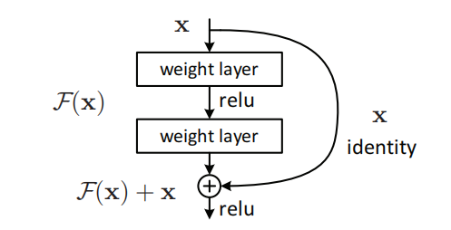
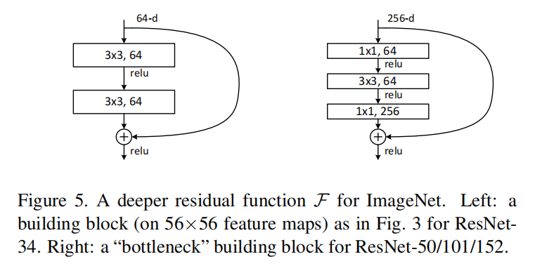
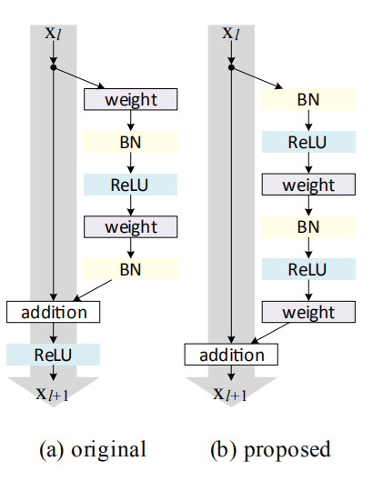
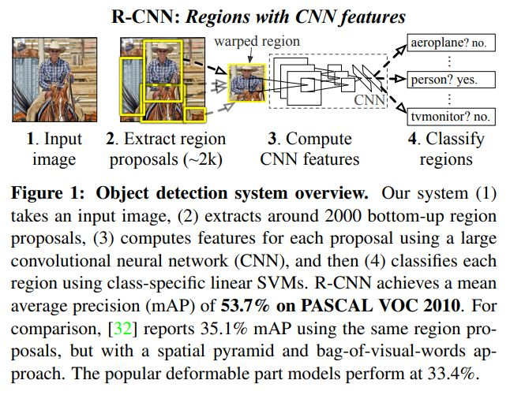
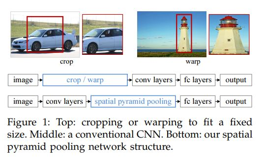
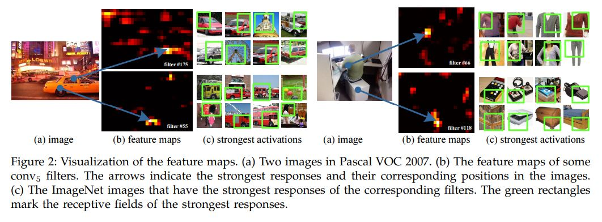
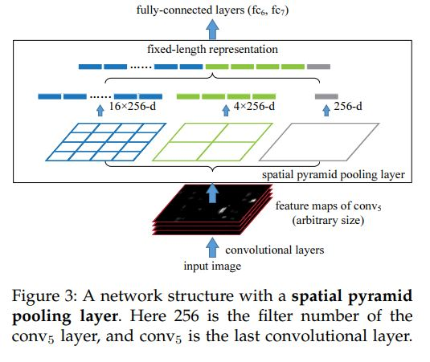
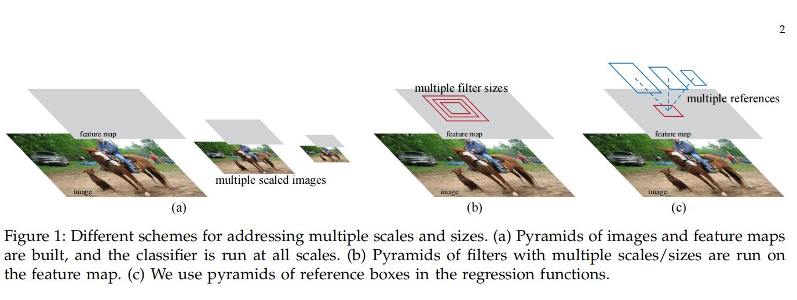
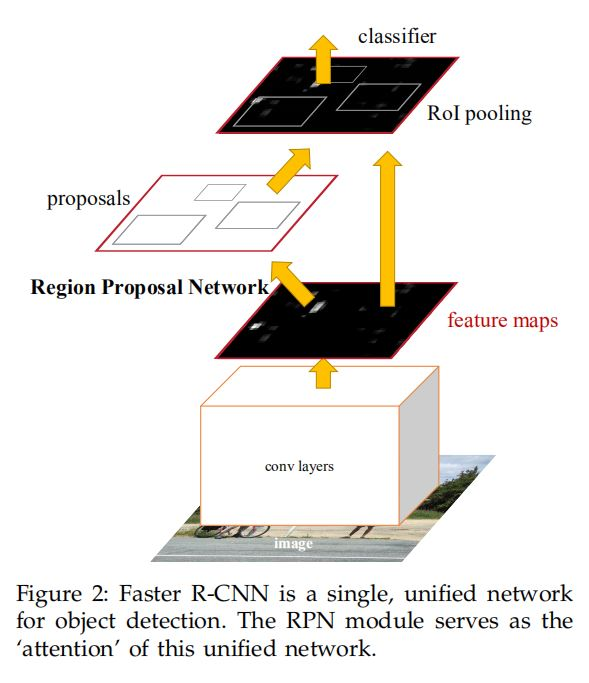
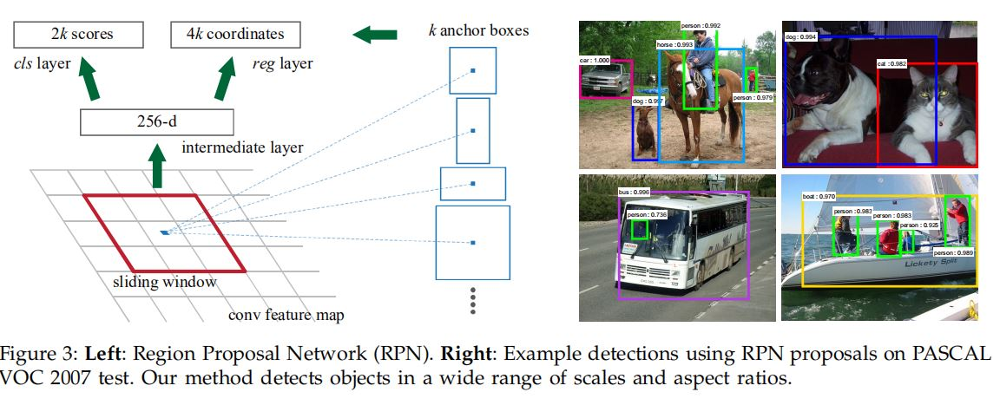

# What should we do to find an ideal job as a deep learning engineer

# Content

[1. Books](#1books)

[2. Papers](#2papers)

[3. Concept Explanation](#3concept-explanation)

# 1.Books

- 李航 **"统计学习方法"**
- 周志华 **"机器学习"**

- 何海涛 **"剑指offer"**

- 诸葛越 **"百面机器学习"**

- scutan90 [**"DeepLearning-500-questions"**](https://github.com/scutan90/DeepLearning-500-questions)

- huihut [**C/C++ 技术面试基础知识总结**](https://github.com/huihut/interview)

- Stephen Prata **"C++ Primer Plus"**

- **"数据结构"**

- Ian Goodfellow [**"深度学习"**](https://exacity.github.io/deeplearningbook-chinese/)

# 2.Papers

## Content

[Image Classification](#image-classification)

[Models](#Models)

[Compact Network Design](#Compact-Network-Design)

[Neural Architecture Search](#Neural-Architecture-Search)

[Efficient Computation](#Efficient-Computation)

[Optimization](#Optimization)

[Object Detection](#Object-Detection)

[Deep Generative Model](#Deep-Generative-Model)

[Deep Reinforcement Learning](#Deep-Reinforcement-Learning)

## Image Classification

##### 2012

### AlexNet 

<b><details><summary> **"Imagenet classification with deep convolutional neural networks"**</summary></b>

#### Reference

[1] [**"Imagenet classification with deep convolutional neural networks"**](https://papers.nips.cc/paper/4824-imagenet-classification-with-deep-convolutional-neural-networks.pdf)

</details>

##### 2014

### VGGNet

<b><details><summary> **"Very deep convolutional networks for large-scale image recognition"**</summary></b>
	

1. The use of stack 3×3 filters is effient than of 5×5 or 7×7 filters

2. A deep net with small filters outperforms a shallow net with larger filters

3. Combining the outputs of several models by averaging their soft-max class posteriors improves the performance due to complementarity of the models

#### Reference

[1] [**"Very deep convolutional networks for large-scale image recognition"**](https://arxiv.org/pdf/1409.1556.pdf)

[2] [Review: VGGNet — 1st Runner-Up (Image Classification), Winner (Localization) in ILSVRC 2014](https://medium.com/coinmonks/paper-review-of-vggnet-1st-runner-up-of-ilsvlc-2014-image-classification-d02355543a11)

[3] [Keras implement vgg-16](https://github.com/keras-team/keras-applications/blob/master/keras_applications/vgg16.py)

[4] [Keras implement vgg-19](https://github.com/keras-team/keras-applications/blob/master/keras_applications/vgg19.py)

</details>

### NIN

<b><details><summary>**"Network In Network"**</summary></b>
	
1. Proposed a new network structure--mlpconv layer

  

2. Usually, fully connected layers are used at the end of network, however, they are prone to overfitting. This article used global average pooling layer as the last layer of the network, it is more native to the convolution structure by enforcing correspondences between feature maps and categories, and could prevent over-fitting.

#### Reference

[1] [**"Network In Network"**](https://arxiv.org/abs/1312.4400)

[2] [Review: NIN — Network In Network (Image Classification)](https://towardsdatascience.com/review-nin-network-in-network-image-classification-69e271e499ee)
	
</details>
	

##### 2015

### GoogLeNet

<b><details><summary>**"Going deeper with convolutions"**</summary></b>
	


1. **1×1 convolution** is used as a dimension reduction module to reduce the computation. By reducing the computation bottleneck, depth and width can be increased
2. When image’s coming in, **different sizes of convolutions** as well as max pooling are tried. Then different kinds of features are extracted.
3. **Global average pooling** is used nearly at the end of network by averaging each feature map from 7×7 to 1×1, and authors found that a move from FC layers to average pooling improved the top-1 accuracy by about 0.6%.
4. **Auxiliary classifiers** for combating gradient vanishing problem, also providing regularization.
5. besides the network design, the other stuffs like **ensemble methods**, multi-scale and multi-crop approaches are also essential to reduce the error rate


#### Questions

- inception 结构的优点

  文章认为，通过1x1, 3x3, 5x5并列最后拼接的结构，可以让模型同时感受到多尺度的特征。

- 1x1卷积的作用

  作用是对feature的通道数进行降维，可以大幅度减少模型的运算量，实际上这种分解方式可以通过low-rank来解释，用两个卷积层来等效一个卷积，但大大降低了运算量

- 预测为什么使用global average pooling

  相比全连接层，先通过global average pooling再连接Dense层或直接激活可以大大降低运算量，因为一个模型的最后一层FC往往参数量十分巨大，而且论文证明使用global average pooling的效果也略微更好一点

- 辅助分类器的作用

  对抗梯度消失问题，同时有一定的正则化作用

#### Reference

[1] [**"Going deeper with convolutions"**](https://www.cs.unc.edu/~wliu/papers/GoogLeNet.pdf)

[2] [Pytorch implement](https://github.com/pytorch/vision/blob/master/torchvision/models/inception.py)

[3] [Review: GoogLeNet (Inception v1)— Winner of ILSVRC 2014 (Image Classification)](https://medium.com/coinmonks/paper-review-of-googlenet-inception-v1-winner-of-ilsvlc-2014-image-classification-c2b3565a64e7)
	
</details>

### ResNet

<b><details><summary> **"Deep residual learning for image recognition"**</summary></b>


1. Degradation problem

   With the network depth increasing, accuracy gets saturated and degrades rapidly, this may be caused by vanishing/exploding gradients problem. But in theory, a deeper network should produce no higher training error than its shallower counterpart.

2. Residual Block

   To solve the degradation problem, residual learning was proposed. Instead of hoping each layer directly fit a desired underlying mapping, we explicitly hope it fit a residual mapping. Denoting the underlying mapping as H(x), we fit a mapping F(x) = H(x) - x.

   Let's consider an extreme condition, if the identity mapping were optimal, it would be easier to push the residual to zero than to fit an identity mapping.

   

   The dimension of x and F(x) must be equal, if not, we could perform a linear projection to match the dimensions.

3. Bottleneck Architecture

   

   The 1x1 conv layer are used to reduce and then increase dimensions, leaving the 3x3 conv a bottleneck with smaller input/output dimensions.

#### Questions

1. ResNet的创新点？

   ResNet提出了残差学习的概念，以往的网络学习的是输入输出的潜在映射，假设为H(x)，而ResNet学习的是潜在映射与输入的残差，即F(x)=H(x)-x。作者认为学习残差比直接学习映射要更容易。假设当前输入已经最优，那么理论上没有残差，此时神经网络学习令残差为0显然是更容易的。

2. ResNet如何解决深层网络训练困难的问题

   神经网络越来越深以后，面对严重的梯度消失和梯度爆炸的问题，正确率常常呈现饱和然后快速下降的趋势，然而理论上更深的网络性能不应低于其较浅的版本。通过残差学习的方法，令神经网络的每一层更容易学习到我们想要的潜在映射，训练速度也更快，解决了深层网络训练困难的问题。

3. ResNet为什么能提升性能？

   学习残差相比直接学习潜在映射要更容易，因此也更容易达到最优。

4. 讲讲ResNet提出的bottleneck结构

   bottleneck是卷积核大小分别为1x1,3x3,1x1的三层网络的叠加，其中1x1 conv用于通道变换，分别将输入通道减少为原来的1/k，以及在3x3卷积之后将通道数恢复。这样可以大大减小3x3卷积的参数量及运算量。

5. ResNet的shortcut可以之间可以只有一层卷积层吗？

   不可以，因为这样残差块的表达式变为H(x) = F(x) + x = relu(Wx)+x, 接近于一个线性单元，实际测试效果也并不好。

#### Reference

[1] [Deep Residual Learning for Image Recognition](https://arxiv.org/abs/1512.03385)

[2] [Keras Implementation](https://github.com/keras-team/keras-applications/blob/master/keras_applications/resnet_common.py)

[3] [PyTorch Implementation](https://github.com/pytorch/vision/blob/master/torchvision/models/resnet.py)


</details>

### Inception-v3

<b><details><summary> **"Rethinking the Inception Architecture for Computer Vision"**</summary></b>
	
1. Factorizing Convolutions with Large Filter Size

   In theory, we can **replace any n x n convolution by a 1 x n convolution followed by a n x 1 convolution** and the computational cost saving increases dramatically as n grows.

   In practice, **it is found that employing this factorization does not work well on early layers, but it gives very good results on medium grid-size.**


2. Utility of Auxiliary Classifiers

   The auxiliary classifiers act as **relularizer**.


3. Efficient Grid Size Reduction

   ** Conventionally**, such as AlexNet and VGGNet, the feature map downsizing is done by max pooling. But the drawback is either **too greedy by max pooling followed by conv layer**, or **too expensive by conv layer followed by max pooling**. Here, an efficient grid size reduction is proposed as follows:


With the efficient grid size reduction, **320 feature maps** are done by **conv with stride 2**. **320 feature maps** are obtained by **max pooling**. And these 2 sets of feature maps are **concatenated as 640 feature maps** and go to the next level of inception module.

**Less expensive and still efficient network** is achieved by this efficient grid size reduction.

4. Overall Architecture


5. General Design Principles
   1. **Avoid representational bottlenecks, especially early in the network.** One should avoid bottlenecks with extreme compression. In general, the representation size should gently decrease. Theoretically, information content can not be assessed merely by the dimensionality of the representation as it discards important factors like correlation structure, the dimensional merely provides a rough estimate of information content.
   2. **Higher dimensional representations are easier to process locally within a network.** Increasing the activation per tile in a network allows for more disentangled features. The resulting networks will train faster.
   3. **Spatial aggregation can be done over lower dimensional embeddings without much or any loss in representational power.** The strong correlation between adjacent units results in much less loss of information during dimension reduction.
   4. **Balance the width and depth of the network.** Increasing both the width and depth of the network can contribute to higher quality network.

#### Questions

- 相比googleNet有哪些改进

  - 用两个相连的3x3卷积代替5x5卷积，降低了运算复杂度。
  - 通过low-rank分解，将nxn的卷积分解为两个1xn和nx1的卷积，降低了模型的运算复杂度。
  - 通过stride=2的卷积和avg_pool的filter concat实现feature降维，是一种折中的解决方案。
  - 证明了辅助分类器的正则化作用

- 有什么缺点

  过于宽且深度不同的Inception block会大大降低模型的训练以及预测速度

#### Reference 

[1] [Rethinking the Inception Architecture for Computer Vision](https://www.cv-foundation.org/openaccess/content_cvpr_2016/papers/Szegedy_Rethinking_the_Inception_CVPR_2016_paper.pdf)

[2] [Keras implement](https://github.com/keras-team/keras-applications/blob/master/keras_applications/inception_v3.py)

[3] [Pytorch implement](https://github.com/pytorch/vision/blob/master/torchvision/models/inception.py)

[4] [Review: Inception-v3 — 1st Runner Up (Image Classification) in ILSVRC 2015](https://medium.com/@sh.tsang/review-inception-v3-1st-runner-up-image-classification-in-ilsvrc-2015-17915421f77c)
	
</details>
	

##### 2016

### ResNet-v2

<b><details><summary>**"Identity Mappings in Deep Residual Networks"**</summary></b>



1. Analysis of Deep Residual Networks

   Original residual unit:
   $$
   y_l = h(x_l) + F(x_l, W_l)\\
   x_{l+1} = f(y_l)
   $$
   If h and f are identity mapping:
   $$
   x_{l+1} = x_l + F(x_l, W_l)\\
   x_L = x_l + \sum_{i=l}^{L-1}F(x_i, W_i)
   $$
   Which means the feature $x_L$ of any deeper unit L can be represented as the feature $x_l$ of any shallower unit l plus a residual function F, the feature $x_L$ of any deep unit L, is the summation of the outputs of all preceding residual functions (plus $x_0$). **This ensures that information is directly propagated back to any shallower unit.**

2. Importance of Identity Skip Connections

   Shortcut connections are the most direct paths for the information to propagate. Multiplicative manipulations (scaling, gating, 1x1 convolutions, dropout) on the shortcuts can hamper information propagation and lead to optimization problem

3. Pre-Activation

   1. the optimization is further eased because f is an identity mapping
   2. using BN as pre-activation improves regularization of the model

#### Questions

1. ResNetV2 主要讲了什么？

   作者重新思考了resnet的residual unit，提出了一种新的residual unit，shortcut改为完全的identity connection，去除之前的ReLU层，同时将每一层之后的激活和BN放到之前

2. 为什么Identity Skip Connection效果好

   根据文章的介绍，直接的identity连接可以让每一层直接连接到前面所有层的输出上，让梯度反向传播更加通畅，identity的连接也不容易发生梯度消失或爆炸的问题。

3. 为什么采用pre-activation

   将BN和激活函数放在卷积之前，可以保证卷积输入的分布一定是稳定的，防止未经BN激活的shorcut流入卷积层，同时还保证了shortcut的identity

#### Reference

[1] [Identity Mappings in Deep Residual Networks](https://arxiv.org/abs/1603.05027)

[2] [Keras Implementation](https://github.com/keras-team/keras-applications/blob/master/keras_applications/resnet_common.py)

</details>

### Inception-v4

<b><details><summary> **"Inception-v4, Inception-ResNet and the Impact of Residual Connections on Learning"**</summary></b>
	
1. It is studied that whether the Inception itself can be made more efficient by making it deeper and wider.

   In order to optimize the training speed, **the layer sizes was tuned carefully to balance the computation between the various model sub-networks**.

2. Since the residual connections are of inherent importance for  training very deep architectures. **it is natural to replace the filter concatenation stage of the Inception architecture with residual connections.**

   **Inception-Resnet-v1 was training much faster, but reached slightly worse final accuracy than Inception-v3.** 

   If the number of filters exceeded 1000, the residual variants started to exhibit instabilities, and the network just “died” early during training. This could be prevented, neither by lowering the learning rate, nor by adding an extra BN to this layer. However, scaling down the residuals before adding them to the previous layer activation seemed to stabilize the training.

   Two-phase training is also suggested, where the first "warm-up" phase is done with very low learning rate, followed by a second phase with high learning rate.

#### Questions

- 有什么改进
  - 微调inception结构来弥补其在运算速度上的劣势
  - 改用residual结构来提高模型训练的速度

#### Reference

[1] [[Inception-v4, Inception-ResNet and the Impact of Residual Connections on Learning](https://www.aaai.org/ocs/index.php/AAAI/AAAI17/paper/download/14806/14311)

[2] [Keras Implementation](https://github.com/keras-team/keras-applications/blob/master/keras_applications/inception_resnet_v2.py)
	
</details>
	
### Attention

<b><details><summary>**"Show, Attend and Tell Neural Image Caption Generation with Visual Attention"**</summary></b>
	
</details>

##### 2018

### DenseNet 

<b><details><summary>**"Densely Connected Convolutional Networks"**</summary></b>

1. DenseBlock

   Standard ConvNet

   

   ResNet

   

   DenseNet

   

   Each layer obtains additional inputs from all preceding layers and passes on its own feature maps to all subsequent layers. 

   Feature maps output by current layer and preceding layers are combined together by concatenating them.

   

   DenseNet layers are very narrow (e.g., 12 filters per layer), adding only a small set of feature maps to the collective knowledge of remaining feature maps unchanged and the final classifier makes a decision based on all feature map in the network.

   Besides better parameter efficiency, one big advantage of DenseNets is their **improved flow of information and gradients** througout the network, which makes them easy to train. Each layer has direct access to the gradients from the loss function and the original input signal, leading to an implicit deep supervision.

2. Overall architecture

   

3. Model Compactness

   As a direct consequence of the input concatenation, the feature-maps learned by any of the DenseNet layers can be accessed by all subsequent layers. This encourages feature reuse throughout the network, and leads to more compact models.

4. Implicit Deep Supervision

   One explanation for the improved accuracy of dense convolutional networks may be that individual layers receive additional supervision from the loss function through the shorter connections.

   A single classifier on top of the network provides direct supervision to all layers through at most two or three transition layers. However, the loss function and gradient of DenseNets are substantially less complicated, as the same loss function is shared between all layers.

5. Feature Reuse

   By design, DenseNets allow layers access to feature-maps from all of its preceding layers (although sometimes through transition layers). We conduct an experiment to investigate if a trained network takes advantage of this opportunity.

   1. All layers spread their weights over many inputs within the same block. This indicates that features extracted by very early layers are, indeed, directly used by deep layers throughout the same dense block.
   2. The weights of the transition layers also spread their weight across all layers within the preceding dense block, indicating information flow from the first to the last layers of the DenseNet through few indirections.
   3. The layers within the second and third dense block consistently assign the least weight to the outputs of the transition layer (the top row of the triangles), indicating that the transition layer outputs many redundant features (with low weight on average). This is in keeping with the strong results of DenseNet-BC where exactly these outputs are compressed
   4. Although the final classification layer, shown on the very right, also uses weights across the entire dense block, there seems to be a concentration towards final feature-maps, suggesting that there may be some more high-level features produced late in the network.

#### Questions

1. 讲讲DenseNet

   DenseNet的主要思想是用shortcut connection将所有网络层都连接起来，形成密集的层之间的全连接，这样可以让每一层都能得到之前所有层的信息作为输入，同时，每一层都能与最后的分类器连接，这样可以让信息和梯度的流通更加顺畅。

2. DenseNet和ResNet的异同

   DenseNet和ResNetV2很像，区别是DenseNet的shortcut是用filter concatenation，而ResNet的shortcut是feature addition.不仅数据连通流动的方式不同，网络结构上也因此产生了很大的区别。DenseNet每一层的filter数很少，产生的新的feature map 直接拼接到输入数据中，对之前层产生信息的重复利用，让DenseNet的filter数可以很少，参数量少于ResNet

#### Reference

[1] [Densely Connected Convolutional Networks](https://arxiv.org/abs/1608.06993)

[2] [Review: DenseNet — **Dense Convolutional Network** (Image Classification)](https://towardsdatascience.com/review-densenet-image-classification-b6631a8ef803)

[2] [Keras Implementation](https://github.com/pytorch/vision/blob/master/torchvision/models/densenet.py)

</details>

## Compact Network Design

##### 2016

### SqueezeNet 

<b><details><summary>**"SqueezeNet: AlexNet-level accuracy with 50x fewer parameters and <0.5MB model size"**</summary></b>
	
</details>

##### 2017

### Xception 

<b><details><summary>**"Xception: Deep Learning with Depthwise Separable Convolutions"**</summary></b>

1. 

#### Questions

#### Reference


</details>
	

### MobileNet 

<b><details><summary>**"MobileNets: Efficient Convolutional Neural Networks for Mobile Vision Applications"**</summary></b>
	
1. Depthwise separable convolution


(This figure is a little confusing that the last 1x1 conv actually is a ordinary 1x1 conv layer that has depth of M, and there are N such filters)

Standard convolution has the computatianal cost of:
$$
D_K \cdot D_K \cdot M \cdot N \cdot D_F \cdot D_F
$$

where $D_K$ is the size of the kernel, $D_F$is the size of the input feature map, $M$ and $N$ is the number of input and out put channels.

Depthwise saparable convolutions cost:

$$
D_K \cdot D_K \cdot M \cdot D_F \cdot D_F + M \cdot N \cdot D_F \cdot D_F
$$

2. Width Multiplier α is introduced to **control the input width of a layer**, for a given layer and width multiplier α, tαhe number of input channels M becomes αM and the number of output channels N bocomes αN

3. Resolution Multiplier ρ is introduced to **control the input image resolution**of the network

4. Overall architecture


#### Questions

- 请简要介绍MobileNet

  MobileNet是一种轻量级神经网络模型，它通过Depthwise separable convolution的方式大大降低了运算量。DW卷积的原理是对输入的每一通道分离，分别用一个filter进行卷积操作，得到一个feature map，之后所有的feature map再通过一个1x1PW卷积进行通道变换，解决DW卷积导致的通道之间信息交流不畅的问题。

- 与传统卷积的运算量对比

  假定输入为$D_k \times D_k \times M$的tensor，输出通道数为N，传统卷积的运算量为$D_K \cdot D_K \cdot M \cdot N \cdot D_F \cdot D_F$, DW卷积的运算量为$D_K \cdot D_K \cdot M  \cdot D_F \cdot D_F$, PW卷积的运算量为$M \cdot N \cdot D_F \cdot D_F$.

#### Reference

[1][**"MobileNets: Efficient Convolutional Neural Networks for Mobile Vision Applications"**](https://arxiv.org/abs/1704.04861)

[2][Keras implementation](https://github.com/keras-team/keras-applications/blob/master/keras_applications/mobilenet.py)

[3][Review: MobileNetV1 — Depthwise Separable Convolution (Light Weight Model)](https://towardsdatascience.com/review-mobilenetv1-depthwise-separable-convolution-light-weight-model-a382df364b69)
	
</details>
	
### ResNeXt 

<b><details><summary>**"Aggregated Residual Transformations for Deep Neural Networks"**</summary></b>
	
</details>

### ShuffleNet 

<b><details><summary>**"ShuffleNet: An Extremely Efficient Convolutional Neural Network for Mobile Devices"**</summary></b>
	
1. Channel shuffle

   Stacked group convolutions has one side effect: outputs from a certain channel are only derived from a small fraction of input channel, this property blocks information flow between channel groups and weakens representation.

   Then it is naturally to shuffle the channels between group convolutions, making  it possible to fully relate the input and output channels. Moreover, it is also differentiable, which means it can be embedded into network structure for end-to-end training.

2. Shuffle Unit

   

   (a) is a residual block with 3x3 depthwise convolution. Then replace the first 1x1 layer with pointwise group convolution followed by a channel shuffle operation. And the second pointwise group convolution is to recover the channel dimension to match the shortcut path.(Which is (b))

   And (c) is how shuffle net apply stride=2, it's a inception like structure.

   Given the input size of c x h x w and the bottleneck channels m, group number g, the number of FLOPs of shuffle net unit is:
   $$
   hwcm/g + 9hwm + hwcm/g = hw(2cm/g+9m)
   $$
   
3. Ablation study

   1. Model with group convolutions (g>1) consistently perform better than the counterparts without pointwise group convolutions(g=1), smaller models tend to benefit more from groups.
   2. When group number is relatively large, models with channel shuffle outperform the counterparts by a significant margin, which shows the importance of cross-group information interchange.

#### Questions

- 介绍一下shuffle net

  shuffle net是一种轻量级网络，它通过group convolution和depthwise convolution来减小网络的运算复杂度。shuffle net的创新点在于在group convolution之后增加了一个channel shuffle，可以解决group conv各group之间信息无法流通导致的模型表达能力下降的问题。

- 画一下shuffle net的结构，计算复杂度

  见前述

#### Reference

[1] [ShuffleNet: An Extremely Efficient Convolutional Neural Network for Mobile Devices](https://arxiv.org/abs/1707.01083)
	
</details>

### CondenseNet 

<b><details><summary>**"CondenseNet: An Efficient DenseNet using Learned Group Convolutions"**</summary></b>
	
</details>

##### 2018

### MobileNetV2 

<b><details><summary>**"MobileNetV2: Inverted Residuals and Linear Bottlenecks"**</summary></b>
	
1. Linear Bottlenecks

Deep networks only have the power of a linear classifier on the non-zero volume part of the output domain, on the other hand, when ReLU collapses the channel, it inevitably loses information in that channel.

	- if the manifold of interest remains non-zero volume after ReLU transformation, it corresponds to a linear transformation.
	- ReLU is capable of preserving complete information about the input manifold, but only if the input manifold lies in a low-dimensional subspace of the input space.

Assuming the manifold of interest is low-dimensional we can capture this by inserting linear bottleneck layers into the convolutional blocks. Experimental evidence suggests that **using linear layers is crucial as it prevents non-linearities from destroying too much information**.

2. Inverted residuals


$h \cdot w \cdot k \cdot t (k + d^2 + k')$

3. Convolutional Blocks


The first 1x1 Conv in MobileNetV2 is used for expanding input depth (by 6 default).

4. Overall Architecture


#### Questions

- V2相比V1有哪些改进

  1. 采用inverted residual结构，在block中第一个1x1conv和DW conv之间进行通道扩大以提取更多特征，并在stride=1的block最后采用与ResNet类似的相加结构。
  2. 为避免ReLU对特征的破坏，在residual block的相加之前的1x1conv采用线性激活

- 为什么使用线性激活

  文章认为网络的激活函数会产生一份信息的副本，且此副本存在某种低维子空间表示，因此可以对通道进行降维，但是当维度较低时非线性激活会产生较大的信息损失。因此文章先将通道数扩大，再进行激活，而最后通道缩小时则采用线性激活以避免信息损失。

#### Reference

[1][**"MobileNetV2: Inverted Residuals and Linear Bottlenecks"**](https://arxiv.org/abs/1801.04381)

[2][Keras implementation](https://github.com/keras-team/keras-applications/blob/master/keras_applications/mobilenet_v2.py)

[3][Review: MobileNetV2 — Light Weight Model (Image Classification)](https://towardsdatascience.com/review-mobilenetv2-light-weight-model-image-classification-8febb490e61c)

</details>

### ShuffleNetV2 

<b><details><summary>**"ShuffleNet V2: Practical Guidelines for Efficient CNN Architecture Design"**</summary></b>
	
1. Metrics for efficient computation

   Widely used metric--**the number of float-point operations, or FLOPs**--is not equivalent to the direct metric we really care about, such as speed or latency.

   - first, several important factors that have considerable affection on speed are not taken into account by FLOPs.One such factor is **memory access cost (MAC)**, Another one is **degree of parallelism**.
   - Second, operations with the same FLOPs could have different running time, depending on the platform.

2. Practical Guidelines for Efficient Network Design

   1. **Equal channel width minimizes memory access cost (MAC)**

       We study the kernel shape of the 1 × 1 convolution. The shape is specified by two parameters: the number of input channels $c_1$ and output channels $c_2$. Let h and w be the spatial size of the feature map, **the FLOPs of the 1 × 1 convolution is $B = hwc_1c_2$. ****The memory access cost**
      **(MAC), or the number of memory access operations, is $MAC = hw(c_1+c_2)+c_1c_2$**. So
      $$
      MAC \ge 2\sqrt{hwB} + \frac{B}{hw}
      $$
      Therefore, MAC has a lower bound given by FLOPs. **It reaches the lower bound when the numbers of input and output channels are equal**.

   2. **Excessive group convolution increases MAC**
      $$
      \begin{align*}
      MAC =& hw(c_1+c_2) + \frac{c_1c_2}{g}\\
      =& hwc_1 + \frac{Bg}{c_1} + \frac{B}{hw}
      \end{align*}
      $$
      where g is the number of groups and $B=hwc_1c_2/g$ is the FLOPs.  It is easy to see that, given the fixed input shape c1 × h × w and the computational cost B, **MAC increases with the growth of g**.

      Therefore, we suggest that *the group number should be carefully chosen based on the target platform and task. It is unwise to use a large group number simply because this may enable using more channels, because the benefit of accuracy increase can easily be outweighed by the rapidly increasing computational cost*

   3. **Network fragmentation reduces degree of parallelism**

      Though such fragmented structure has been shown beneficial for accuracy, it could decrease efficiency because it is unfriendly for devices with strong parallel
      computing powers like GPU. It also introduces extra overheads such as kernel launching and synchronization.

   4. **Element-wise operations are non-negligible**

      element-wise operations occupy considerable amount of time, especially on GPU. Here, the element-wise operators
      include ReLU, AddTensor, AddBias, etc. They have small FLOPs but relatively heavy MAC. Specially, we also consider depthwise convolution as an element-wise operator as it also has a high MAC/FLOPs ratio.

3. ShuffleNetV2 

   

   

   Note that there is an additional 1x1 convolution layer added right before global averaged pooling to mix up features.

#### Questions

- Shuffle net v2 对efficient computation提出了什么问题

  过去使用的评价标准FLOPs，即浮点运算数，并不能完全代表网络的运算性能，它与更直观的指标如速度之间存在一定差异性。因此文章重新考虑了之前的经典网络，提出了高效计算的一般性的原则，并提出了新的网络架构。

- shuffle net v2提出了哪些原则

  - bottle neck的或1x1 pointwise conv 的输入和输出channel数应尽量接近，这样可以在FLOPs一定的情况下，使内存消耗MAC达到其下界。
  - group channel的分组数越大，内存消耗MAC越大。因此应该谨慎得选择分组数
  - 类似于Inception的结构，网络的碎片化越严重，并行支路越多，网络速度越慢。（当然串行的网络结构也很慢），因此应当适当选择网络单元的宽度和深度。
  - element wise操作也不可忽视，如ReLU, Add以及depthwise conv对网络速度的影响也很大，应尽量减少此类操作。

- 试分析FLOPs和MAC的关系

  给定输入feature map大小为 h x w， 输入输出channel数为 m， n，1x1 conv layer的浮点运算数为$B = hwmn$，输入feature数为$hwm$, 输出feature数为$hwn$，卷积核参数为$mn$， 因此MAC总数为$MAC=hw(m+n) + mn$. 由不等式关系有$MAC \ge 2\sqrt{hwB} + \frac{B}{hw}$. 当m=n时达到下界。

- 简述shufflenet v2和v1的区别

  - v2在单元中首先按channel将feature map分为两组，一组作为shortcut，而不是复制一份作为shortcut
  - v2取消了1x1conv的group conv，因为分组会减低速度
  - v2将末端的add改为了concat，因为add会影响速度
  - v2将shuffle 操作移动到了concat之后，因为两路是不同的channel，这样可以加强两路之间的交流。
  - 对于stride=2的unit，没有channel split，两边各自进行strid=2的DW conv，最后feature map减半，channel数double
  - 在最后的global pool之前加了一层1x1 conv 加强通道之间的交流

#### Reference

[1] [ShuffleNet V2: Practical Guidelines for Efficient CNN Architecture Design](https://arxiv.org/abs/1807.11164)

[2] [Pytorch implementation](https://github.com/pytorch/vision/blob/master/torchvision/models/shufflenetv2.py)

[**back to top**](#content)
	
</details>


## Neural Architecture Search

##### 2016

### Nas 

<b><details><summary>**Neural Architecture Search with Reinforcement Learning**</summary></b>
	
</details>

##### 2018

### NASNet 

<b><details><summary>**"Learning Transferable Architectures for Scalable Image Recognition"**</summary></b>
	
1. **Search for an architectural building block on a small dataset and the transfer the block to a larger dataset.**

   Design a search space so that the complexity of the architecture is independent of the depth of the network and the size of the input images. Searching for the best network architecture is therefore reduced to searching for the best cell structure.

2. **Predict a generic convolutional cell expressed in terms of "motifs"**

   By doing this, it is enough to only predict a **Normal Cell** and a **Reduction Cell**, and simply stack them in series.

   

3. RNN Controller

   

   

   - The algorithm appends the newly-created hidden state to the set of existing hidden states as a potential input in subsequent blocks. The controller RNN repeats the above 5 prediction steps B times corresponding to the B blocks in a convolutional cell.(B=5)

   - In steps 3 and 4, the controller RNN selects an operation to apply to the hidden states:

   

   - In step 5 the controller RNN selects a method to combine the two hidden states, either (1) element-wise addition between two hidden states or (2) concatenation between two hidden states along the filter dimension
- Specifically, the controller RNN is a one-layer LSTM with 100 hidden units at each layer and 2×5*B* softmax predictions for the two convolutional cells (where *B* is typically 5) associated with each architecture decision.
   - Each of the 10*B* predictions of the controller RNN is associated with a probability. The joint probability of a child network is the product of all probabilities at these 10*B* softmaxes. This joint probability is used to compute the gradient for the controller RNN.
   - The gradient is scaled by the validation accuracy of the child network to update the controller RNN such that the controller assigns low probabilities for bad child networks and high probabilities for good child networks.
   
   
   
   
   
   
   
   

#### Reference

[1] [Learning Transferable Architectures for Scalable Image Recognition](https://arxiv.org/pdf/1707.07012.pdf)

[2] [Review: NASNet — Neural Architecture Search Network (Image Classification)](https://medium.com/@sh.tsang/review-nasnet-neural-architecture-search-network-image-classification-23139ea0425d)

[3] [Keras Implementation](https://github.com/keras-team/keras-applications/blob/master/keras_applications/nasnet.py)
	
</details>

##### 2019

### MnasNet 

<b><details><summary>**"MnasNet: Platform-Aware Neural Architecture Search for Mobile"**</summary></b>
	
</details>

### MobileNetV3

<b><details><summary>**Searching for MobileNetV3**</summary></b>


#### Questions

#### Reference

[1] [Searching for MobileNetV3](https://arxiv.org/abs/1905.02244)

</details>

## Models

##### 2014

### DropOut 

<b><details><summary>**"Dropout: a simple way to prevent neural networks from overfitting"**</summary></b>
	
</details>

##### 2015

### BatchNorm 

<b><details><summary>**"Batch normalization: Accelerating deep network training by reducing internal covariate shift"**</summary></b>
	
1. Why we use batch normalization?

The distribution of each layer's input changes during training, as the parameters of the previous layers change. This slows down the training by requiring lower learning rate and careful parameter initialization, and makes it notoriously hard to train with saturating nonlinearities. That is **internal covariate shift**!

2. How  does batch norm work?

batch normalization normalizes the output of a previous activation layer by subtracting the batch mean and dividing by the batch standard deviation.

batch normalization adds two trainable parameters to each layer, so the normalized output is multiplied by a “standard deviation” parameter (gamma) and add a “mean” parameter (beta). In other words, batch normalization lets SGD do the denormalization by changing only these two weights for each activation, instead of losing the stability of the network by changing all the weights


> There is a subtle difference between training and inferencing, During training, it is normalized by 

> $\sigma_B^2 \gets \frac{1}{m}\sum_i^m(x_i-\mu_B)^2$

> Then when testing, it is normalized by **unbiased variance estimate**:

> $Var[x] \gets \frac{m}{m-1}E_B[\sigma_B^2]$

3. Advantages 
   1. Batch normalization reduces the amount by what hidden unit values shift around (covariance shift )
   2. Batch normalization has a beneficial effect on the gradient flow through the network, by reducing the dependence of gradients on the scale of the parameters or for their initial values. This allow us to use much higher learning rates without the risk of divergence.
   3. Batch normalization regularizes the model and reduces the need for dropout.
   4. Batch normalized makes it possible to use saturating nonlinearities by preventing the network form getting stuck in the saturated modes.

#### Questions

- BN解决什么问题

  模型训练时，层与层之间存在高度耦合性，当前一层的参数更新后，当前层的输入的分布便发生改变，这增加了训练的难度，需要更小的学习率和初始化策略。对于类似sigmoid之类存在饱和区的激活函数来说这个问题更加严重。

  BN的作用就是在模型的层与层之间进行归一化，具体的操作是对每一mini-batch，在每一特征维度上进行归一化， 使其满足均值为0，方差为1的分布。

  然而这样做会导致数据失去部分其原本的表达能力，落入sigmoid或tanh的线性激活区。因此增加了两个参数$\gamma, \beta$进行线性变换$Z_j = \gamma_j\hat{Z_j}+\beta_j$, 当$\gamma^2=\sigma^2, \beta=\mu$时是一个原始分布的等价变换。同时对于sgd来说BN层的训练参数限定为$\gamma$和$\beta$，增加了模型的稳定性。

- 预测阶段BN怎么产生作用

  保留训练时每个batch的均值与方差，在预测时计算整个数据均值与方差的**无偏估计**，作为预测数据的归一化参数。

- BN是无偏估计吗

  是。

- BN的作用

  - 使网络每层的输入分布相对稳定，加速训练
  - 降低了梯度传播对参数的的敏感性，可以使用更大的学习率
  - 因为相当于为每一层的数据增加了噪声，具有一定的正则化作用，提高了模型的泛化性能。使模型可以不使用dropout。（有论文证明同时使用dropout和BN效果不如只使用他们中的一个）
  - 使深度模型可以使用sigmoid或tanh等具有饱和区的激活函数

- BN中batch size的影响

  当batch size过小时不建议使用BN，均值和方差具有较大的随机性。

- BN的参数数量

  BN层计算参数时将整个输入的feature map当做一个特征进行处理，因此参数数量只与输入的通道数相关（4C）
  
- BN的缺点

  - 当batch size太小的时候，归一化没有什么意义，数据分布依然会剧烈震荡
  - 在RNN中，每个时间点的数据分布不同，需要为每个time-step进行归一化，大大增加了模型的复杂度

#### Reference

[1][**"Batch normalization: Accelerating deep network training by reducing internal covariate shift"**](https://arxiv.org/pdf/1502.03167v3.pdf)

[2][Review: Batch normalization in Neural Networks](https://towardsdatascience.com/batch-normalization-in-neural-networks-1ac91516821c)

[3][Review: Batch Normalization — What the hey?](https://gab41.lab41.org/batch-normalization-what-the-hey-d480039a9e3b)
	
</details>

##### 2016

### Layer Normalization

<b><details><summary>**"Layer Normalization"**</summary></b>

#### Reference

[1] [Layer Normalization](https://arxiv.org/abs/1607.06450)

</details>

### Weight Normalization

<b><details><summary>**"Weight Normalization: A Simple Reparameterization to Accelerate Training of Deep Neural Networks"**</summary></b>

#### Reference

[1] [Weight Normalization: A Simple Reparameterization to Accelerate Training of Deep Neural Networks](https://arxiv.org/abs/1602.07868)

</details>

### Rectifier

<b><details><summary>**"Delving deep into rectifiers: Surpassing human-level performance on imagenet classification"**</summary></b>
	
</details>

### Net2Net 

<b><details><summary>**"Net2net: Accelerating learning via knowledge transfer"**</summary></b>
	
</details>

## Optimization

### SGD

<b><details><summary>**"Stochastic Gradient Descent"**</summary></b>
$$
w_{t+1} = w_t -\alpha\frac{\partial L}{\partial w_t}
$$
#### Questions

1. SGD的缺点

   缺点：对每一样本进行更新，收敛速度慢，同时loss函数常常会剧烈震荡，需要对输入数据进行洗牌。

2. mini-batch sgd and batch sgd

   - mini-batch sgd：每次用一小批样本更新梯度。优点是收敛过程更稳定，也更快，也可以利用矩阵运算加速。缺点是容易被困在鞍点和局部最优
   - batch sgd：对整个数据集计算梯度然后更新。优点是每次更新方向一定是最优；缺点是会被困在鞍点或局部最优，且数据集大时更新速度非常慢

</details>

### Momentum 

<b><details><summary>**"On the importance of initialization and momentum in deep learning"**</summary></b>
$$
w_{t+1} = w_t - \alpha V_t\\
V_t = \beta V_{t-1} + (1 - \beta)\frac{\part L}{\part w_t}\\
\beta = 0.9
$$

#### Questions

1. Momentum的优点

   每次梯度更新时考虑之前的梯度大小和方向，模拟物理中的动量，这样可以让梯度的收敛更快且不易落入局部最优或鞍点

2. Momentum的缺点

   动量过大容易从坡的一端冲过坡底冲上坡的另一端，来回震荡

</details>

### NAG

<b><details><summary>**"Nesterov Accelerated Gradient"**</summary></b>
$$
w_{t+1} = w_t - \alpha V_t\\
V_t = \beta V_{t-1} + (1-\beta)\frac{\part L}{\part w^*}\\
w^* = w_t - \alpha V_{t-1} \\
\beta = 0.9
$$

#### Questions

1. NAG的思想是什么

   为了避免动量法走的太快的问题，我们不是用当前的w的梯度进行更新，而是用预估的下一步的w的梯度进行更新。具体方法是用上一次的梯度，估计下一次更新后w的位置，然后计算该位置的梯度，用于叠加到动量上更新这一步的梯度。这样做的好处是当动量法到坡底后，可以预知下一步的梯度变化从而减速。

</details>

### AdaGrad

<b><details><summary>**"Adam: A method for stochastic optimization"**</summary></b>
$$
w_{t+1} = w_t - \frac{\alpha}{\sqrt{S_t+\epsilon}} \frac{\part L}{\part w_t}\\
S_t = S_{t-1} + (\frac{\part L}{\part w_t})^2\\
\alpha = 0.001\\
\epsilon = 10^{-7}
$$


</details>

### Adam 

<b><details><summary>**"Adam: A method for stochastic optimization"**</summary></b>
	
</details>

### 


### Neural Optimizer 

<b><details><summary>**"Learning to learn by gradient descent by gradient descent"**</summary></b>
	
</details>

#### Reference

[1] [10 Gradient Descent Optimisation Algorithms + Cheat Sheet](https://towardsdatascience.com/10-gradient-descent-optimisation-algorithms-86989510b5e9)

[2] [优化器详解](https://www.cnblogs.com/guoyaohua/p/8542554.html)

[3] [一文看懂各种神经网络优化算法：从梯度下降到Adam方法](https://zhuanlan.zhihu.com/p/27449596)

## Efficient Computation

##### 2015

### Deep Compression 

<b><details><summary>**"Deep compression: Compressing deep neural network with pruning, trained quantization and huffman coding"**</summary></b>
	
</details>

##### 2018

### Survey 

<b><details><summary>**"Recent Advances in Efficient Computation of Deep Convolutional Neural Networks"**</summary></b>
	
1. Pruning 剪枝
  
  1. Fine-grained Pruning 精粒度剪枝
  
  2. Vector-level and Kernel-level Pruning
  
  3. Group-level Pruning
  
  4. Filter-level Pruning

2. Low-rank 低秩近似

3. Quantization 量化

4. Knowledge Distilation 知识蒸馏

5. Compact Design 结构设计
	

</details>

### Pruning

### Low-Rank

### Quantization

### Knowledge Distillation

## Object Detection

##### 2014

### RCNN 

<b><details><summary>**"Rich feature hierarchies for accurate object detection and semantic segmentation"**</summary></b>



#### Questions

1. 简要介绍RCNN

   RCNN是最早使用CNN进行目标检测的方法，具体来说，RCNN首先用selective search选择候选框，resize成固定大小然后输入预训练好的CNN中，保存feature map，然后通过SVM进行分类，最后进行边界框的回归。

2. RCNN的缺点

   1. 多阶段训练，训练复杂
   2. 训练时间和空间消耗大，RCNN将每个候选框输入CNN进行运算，造成了大量的重复运算，且SVM分类效果一般，参数量大，速度慢。
   3. 预测速度慢

3. 简述NMS：

   主要目的是剔除过于接近的候选框。具体来说，对于IoU超过阈值的框，只保留可信度较高的。

4. 损失函数：

   预训练CNN时对于和ground truth的IoU大于0.5的框视为正类，训练SVM时阈值为0.3

</details>

### SPPNet 

<b><details><summary>**"Spatial pyramid pooling in deep convolutional networks for visual recognition"**</summary></b>







#### Questions

1. SPPNet主要思想

   SPPNet主要时为了解决CNN必须输入特定尺寸图像的问题。SPPNet采用了spatial pyramid pooling的方法，对神经网络的输出特征图进行max-pooling，将其pooling到不同尺寸，这样便可以使用不同尺寸的全连接层，检测不同尺度的特征

2. 相比RCNN的改进

   SPPNet只将输入图像通过CNN一次，在最后的输出特征图上，根据不同尺度的classifier来进行分类与检测，节约了大量的计算

3. 为什么在特征图上也可以实现检测

   因为文章发现输入图像中的目标会在特征图的对应位置上产生强响应，因此不必像RCNN一样在输入之前进行特征位置选择。

4. SPPNet的缺点

   多阶段训练，需要硬盘存储

</details>

##### 2015

### Fast R-CNN 

<b><details><summary>**"Fast R-CNN"**</summary></b>

​	

A Fast R-CNN network takes as input an entire image and a set of object proposals. The network first processes the whole image with several convolutional (*conv*) and max pooling layers to produce a conv feature map. Then, for each object proposal a region of interest (*RoI*) pooling layer extracts a fixed-length feature vector from the feature map. Each feature vector is fed into a sequence of fully connected (*fc*) layers that finally branch into two sibling output layers: one that produces softmax probability estimates over K* object classes plus a catch-all “background” class and another layer that outputs four real-valued numbers for each of the *K* object classes. Each set of 4 values encodes refined bounding-box positions for one of the *K* classes.

#### Questions

1. Fast-RCNN的改进

   - RCNN每次提取RoI都要通过一次卷积，FastRCNN借鉴SPPNet的结论，每幅图像只进行一次卷积，而在特征图上通过映射区域选取RoI，大大减少了卷积的运算量。

   - 通过multi-task loss实现single-stage训练，训练可直接更新所有网络层。


2. loss函数：
   $$
L(p,u,t^u,v) = L_{cls}(p,u) + \lambda[u \ge 1]L_{loc}(t^u,v)
   $$
   其中p为预测值，k个类别有k+1个值，u为对应的真值，$L_{cls}$为log loss。v代表真实的边界框的四个坐标值，t为预测值，对每个类别输出对应的坐标偏移值，$L_{loc}$为平滑L1.
   
3. 如何实现多尺度的识别：

   
   1. 暴力搜索：所有图像在输入和输出时处理成固定像素
   2. 图像金字塔：训练时随机采样金字塔尺度

</details>

### Faster R-CNN 

<b><details><summary>**"Faster R-CNN: Towards real-time object detection with region proposal networks"**</summary></b>







#### Questions

1. 最重要的改进

   之前框架最大的局限在于候选区域的选定，本文提出RPN来自动生成region proposals，只在FastRCNN的基础上增加了几层全连接网络。

2. RPN的原理与loss

   RPN建立在FastRCNN的卷积层的基础上，输出为候选框以及候选框是否包含物体。通过在VGG或ZF网络输出的最后一层特征图上，进行3x3卷积，在每一个滑动窗的中心设置k（k=9）个anchor boxes，对应回原图九种不同尺寸不同长宽比的框，当卷积滑动就可以覆盖原图几乎所有可能的候选窗；卷积之后有两个相邻的1x1卷积，分别为分类层（输出2k个值）和回归层（输出4k个坐标偏移值）。损失函数如下：
   $$
   L(\{p_i\},\{t_i\})=\frac{1}{N_{cls}}\sum_i L_{cls}(p_i, p_i^*)+\lambda\frac{1}{N_{reg}}\sum_i p_i^* L_{reg}(t_i, t_i^*)
   $$
   其中，分类损失为log loss，回归损失为smooth-L1.

   用anchor的好处是可以实现平移不变性。

   在训练时，正样本为IOU最大的anchor以及IOU大于0.7的anchor，负样本为IOU小于0.3的anchor，其他忽略。

3. 如何训练

   通过4步训练来实现RPN与RCNN的参数共享：

   1. 用ImageNet的预训练网络训练RPN
   2. 用上一步RPN得到的候选框训练FastRCNN，RCNN同样适用ImageNet预训练网络，此时二者不共享参数
   3. 用上一步得到的RCNN的网络作为RPN的基网络，固定该网络，只训练RPN的顶上几层，此时二者已共享基网络的参数
   4. 最后一步，训练RCNN的顶上几层

#### Reference

[1] [pytorch implementation](https://github.com/chenyuntc/simple-faster-rcnn-pytorch)

</details>

### YOLO 

<b><details><summary>**"You only look once: Unified, real-time object detection"**</summary></b>
	
</details>

### SSD 

<b><details><summary>**"SSD: Single Shot MultiBox Detector"**</summary></b>
	
</details>

##### 2016

### R-FCN 

<b><details><summary>**"R-FCN: Object Detection via Region-based Fully Convolutional Networks"**</summary></b>
	
</details>

### YOLOv2 

<b><details><summary>**"YOLO9000: Better, Faster, Stronger"**</summary></b>
	
</details>

### FPN 

<b><details><summary>**"Feature Pyramid Networks for Object Detection"**</summary></b>
	
</details>

##### 2017

### Mask R-CNN

<b><details><summary>**"Mask R-CNN"**</summary></b>
	
</details>

### RetinaNet 

<b><details><summary>**"Focal Loss for Dense Object Detection"**</summary></b>
	
</details>

### DCN 

<b><details><summary>**"Deformable Convolutional Networks"**</summary></b>
	
</details>

##### 2018

### YOLOv3 

<b><details><summary>**"YOLOv3: An Incremental Improvement"**</summary></b>
	
</details>

## Deep Generative Model

##### 2013

### VAE 

<b><details><summary>**"Auto-encoding variational bayes"**</summary></b>
	
</details>

##### 2014

### GAN 

<b><details><summary>**"Generative adversarial nets"**</summary></b>
	
</details>

##### 2015

### VAE with attention 

<b><details><summary>**"DRAW: A recurrent neural network for image generation"**</summary></b>
	
</details>

## Deep Reinforcement Learning

##### 2013

### atari

<b><details><summary>**"Playing atari with deep reinforcement learning"**</summary></b>
	
</details>

##### 2015

### Human-level control through deep reinforcement learning

<b><details><summary>**"Human-level control through deep reinforcement learning"**</summary></b>
	
</details>

### Continuous control with deep reinforcement learning

<b><details><summary>**"Continuous control with deep reinforcement learning"**</summary></b>
	
</details>

##### 2016

### Asynchronous methods for deep reinforcement learning

<b><details><summary>**"Asynchronous methods for deep reinforcement learning"**</summary></b>
	
</details>

### AlphaGo 

<b><details><summary>**"Mastering the game of Go with deep neural networks and tree search"**</summary></b>
	
</details>

### Deep reinforcement learning with double q-learning

<b><details><summary>**"Deep reinforcement learning with double q-learning"**</summary></b>
	
</details>

##### 2017

### Deep reinforcement learning: An overview

<b><details><summary>**"Deep reinforcement learning: An overview"**</summary></b>
	
</details>

### Target-driven visual navigation in indoor scenes using deep reinforcement learning

<b><details><summary>**"Target-driven visual navigation in indoor scenes using deep reinforcement learning"**</summary></b>
	
</details>

### Deep reinforcement learning for robotic manipulation with asynchronous off-policy updates

<b><details><summary>**"Deep reinforcement learning for robotic manipulation with asynchronous off-policy updates"**</summary></b>
	
</details>

### Playing FPS games with deep reinforcement learning

<b><details><summary>**"Playing FPS games with deep reinforcement learning"**</summary></b>
	
</details>

##### 2018

### Rainbow

<b><details><summary>**"Rainbow: Combining improvements in deep reinforcement learning"**</summary></b>
	
</details>

### Deep reinforcement learning that matters

<b><details><summary>**"Deep reinforcement learning that matters"**</summary></b>
	
</details>

# 3.Concept Explanation

## Contents
[Loss Function](#loss-function)

[Optimizers](#optimizers)

[Gradient Explode and Vanish](#Gradient-Explode-and-Vanish)

[k-means](#k-means)

[PCA](#pca)

## Loss Function

#### Mean Squared Error

$$
MSE = \frac{1}{n} \sum_{i=1}^n (y_i-\hat{y}_i)^2
$$

#### Mean Absolute Error

$$
MSE = \frac{1}{n} \sum_{i=1}^n |y_i-\hat{y}_i|
$$

*L1 loss is more robust to outliers, but its derivatives are not continuous, making it inefficient to find the solution. L2 loss is sensitive to outliers, but gives a more stable and closed form solution (by setting its derivative to 0.)*

#### Mean Absolute Percentage Error 

#### Mean Squared Logarithmic Error

#### Squared Hinge 

#### Hinge

#### Huber

$$
L_\delta = \left\{\begin{array}{lr}
	\frac{1}{2}(y-\hat{y})^2\quad &if|(y-\hat{y}| < \delta)\\
	\delta(y-\hat{y}) - \frac{1}{2}\delta\quad&otherwise
	\end{array}
\right.
$$

*Typically used for regression. It’s less sensitive to outliers than the MSE as it treats error as square only inside an interval.*

#### Categorical Hinge 

#### Logcosh

#### Categorical Crossentropy 

In binary classification
$$
-(ylog(p) + (1-y)log(1-p))
$$
if M > 2(i.e.  multi-class classification)
$$
-\sum_{c=1}^M y_clog(p_c)
$$


#### Sparse Categorical Crossentropy

#### Binary Crossentropy 

#### Kullback-Leibler Divergence

#### Poisson

#### Cosine Proximity

[**back to contents**](#contents)

### Optimizers

#### Adadelta

#### Adagrad

#### Adam

#### Conjugate Gradients

#### BFGS

#### Momentum

#### Nesterov Momentum

#### Newton's Method

#### RMSProp

#### SGD


## Gradient Explode and Vanish

1. What is gradient explosion or vanishing

These problems arise during training of a deep network when the gradients are being propagated back in time all the way to the initial layer. The gradients coming from the deeper layers have to go through continuous matrix multiplications because of the the chain rule, and as they approach the earlier layers, if they have small values (<1), they shrink exponentially until they vanish and make it impossible for the model to learn , this is the vanishing gradient problem. While on the other hand if they have large values (>1) they get larger and eventually blow up and crash the model, this is the exploding gradient problem.

The difficulty that arises is that when the parameter gradient is very large, a gradient descent parameter update could throw the parameters very far, into a region where the objective function is larger, undoing much of the work that had been done to reach the current solution. And when the parameter tradient is very small, the back propagation won't work at all.

2. Why does gradient explosion happen

- Poor choice of learning rate that results in large weight updates.
- Poor choice of data preparation, allowing large differences in the target variable.
- Poor choice of loss function, allowing the calculation of large error values.

3. Why does gradient vanishing happen

Certain activation functions, like the sigmoid function, squishes a large input space into a small input space between 0 and 1. Therefore, a large change in the input of the sigmoid function will cause a small change in the output. Hence, the derivative becomes small.

When n hidden layers use an activation like the sigmoid function, n small derivatives are multiplied together. Thus, the gradient decreases exponentially as we propagate down to the initial layers.

4. Dealing with exploding gradient

Exploding gradients can be avoided in general by careful configuration of the network model, such as choice of small learning rate, scaled target variables, and a standard loss function. Nevertheless, exploding gradients may still be an issue with recurrent networks with a large number of input time steps.

There is a good method to prevent gradient explosion--gradient clipping, which place a predefined threshold on the gradients to prevent it from getting too large.

Keras supports gradient clipping on each optimization algorithm, with the same scheme applied to all layers in the model.

Gradient norm scaling involves changing the derivatives of the loss function to have a given vector norm when the L2 vector norm (sum of the squared values) of the gradient vector exceeds a threshold value.

```
# configure sgd with gradient norm clipping
opt = SGD(lr=0.01, momentum=0.9, clipnorm=1.0)
```

Gradient value clipping involves clipping the derivatives of the loss function to have a given value if a gradient value is less than a negative threshold or more than the positive threshold.

```
# configure sgd with gradient value clipping
opt = SGD(lr=0.01, momentum=0.9, clipvalue=0.5)
```

5. Dealing with Vanishing Gradients

The simplest solution is to use other activation functions, such as ReLU, which doesn’t cause a small derivative.

Residual networks are another solution, as they provide residual connections straight to earlier layers

Finally, batch normalization layers can also resolve the issue. As stated before, the problem arises when a large input space is mapped to a small one, causing the derivatives to disappear. Batch normalization reduces this problem by simply normalizing the input so |x| doesn’t reach the outer edges of the sigmoid function. 

#### Reference:

[1] [How to Avoid Exploding Gradients With Gradient Clipping](https://machinelearningmastery.com/how-to-avoid-exploding-gradients-in-neural-networks-with-gradient-clipping/)

[2] [The curious case of the vanishing & exploding gradient](https://medium.com/learn-love-ai/the-curious-case-of-the-vanishing-exploding-gradient-bf58ec6822eb)

[3] [The Vanishing Gradient Problem](https://towardsdatascience.com/the-vanishing-gradient-problem-69bf08b15484)

[**back to contents**](#content)

## k-means

#### Questions

- 简要介绍一下k-means

  k-means是一种无监督的聚类方法，通过不断迭代将数据聚为k类。具体操作方法为先选择k个数据作为初始中心，之后计算每个数据与每个类中心的距离，将数据归为距离最近的类。之后更新每一类的中心为类内所有点的均值，继续迭代计算距离，重新分类，重新计算均值。不断迭代直到分类不再发生改变。
  
- k-means初始值的选取对最终结果有影响吗？
  
  有
  
- k-means计算距离应该计算什么距离

  应该根据具体情况选择距离度量，不同的距离度量会产生不同的结果。可以选取的常用度量有欧式距离、曼哈顿距离、马氏距离等
  

[**back to contents**](#content)

## PCA

#### Questions

- 简要介绍一下PCA

  PCA即主成成分分析，作用是通过线性映射将数据从高维空间映射到低位空间，并尽量满足信息量不丢失，是数据降维到主要方法之一。PCA寻找数据方差最大的方向，作为第一主成分，之后寻找与之前找到的主成分方向正交的方向中，方差最大的方向，最为次一级主成分，依次将数据映射到最能反映数据信息量的方向上，达到降维的效果。
  
  PCA的具体操作流程为，首先对数据去均值，之后求数据的协方差矩阵，协方差矩阵的对角线代表每一特征的方差，非对角线上为协方差。优化目标为将此协方差矩阵对角化，寻找变换矩阵。具体方法为求协方差矩阵的特征值与特征向量，其中特征向量对应投影方向，特征值对应原始特征投影到该方向之后到方差，这样既可以找到相互正交的向量，也可以找到特征值即方差较大的方向。
  
- PCA的优缺点

  优点：降维的同时，可以消除数据维度之间的相关性
  
  缺点：失去数据原有含义

- 为什么要进行去均值操作

  去均值之后计算数据的协方差变得非常简单，只要计算$x \cdot x^T$即可。
  

[**back to contents**](#content)

