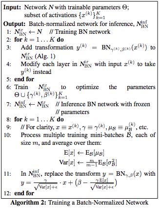

# What should we do to find an ideal job as a deep learning engineer

# Content

[1. Books](#1books)

[2. Papers](#2papers)

[3. Concept Explanation](#3concept-explanation)

# 1.Books
- [ ] 李航 **"统计学习方法"**
- [ ] 周志华 **"机器学习"**
- [ ] 何海涛 **"剑指offer"**
- [ ] 诸葛越 **"百面机器学习"**
- [ ] scutan90 **"DeepLearning-500-questions"** https://github.com/scutan90/DeepLearning-500-questions
- [ ] Stephen Prata **"C++ Primer Plus"**
- [ ] **"数据结构"**
- [ ] Ian Goodfellow [**"深度学习"**](https://exacity.github.io/deeplearningbook-chinese/)

# 2.Papers

## Classical Network Structures

##### 2012
- [x] AlexNet [**"Imagenet classification with deep convolutional neural networks"**](#AlexNet)
##### 2014
- [x] VGGNet [**"Very deep convolutional networks for large-scale image recognition"**](#VGGNet)
- [x] Network in Network [**"Network In Network"**](#NIN)
##### 2015
- [x] GoogLeNet [**"Going deeper with convolutions"**](#GoogLeNet)
- [x] ResNet **"Deep residual learning for image recognition"**
- [ ] Inception-v3 **"Rethinking the Inception Architecture for Computer Vision"**
##### 2016
- [x] Inception-v4 [**"Inception-v4, Inception-ResNet and the Impact of Residual Connections on Learning"**](#Inception-v4)
- [ ] Attention **"Show, Attend and Tell Neural Image Caption Generation with Visual Attention"**
- [ ] SqueezeNet **"SqueezeNet: AlexNet-level accuracy with 50x fewer parameters and <0.5MB model size"**
##### 2017
- [ ] Xception **"Xception: Deep Learning with Depthwise Separable Convolutions"**
- [x] MobileNet [**"MobileNets: Efficient Convolutional Neural Networks for Mobile Vision Applications"**](#MobileNet)
- [ ] ResNeXt **"Aggregated Residual Transformations for Deep Neural Networks"**
- [ ] ShuffleNet **"ShuffleNet: An Extremely Efficient Convolutional Neural Network for Mobile Devices"**
##### 2018
- [x] DenseNet **"Densely Connected Convolutional Networks"**
- [x] MobileNetV2 [**"MobileNetV2: Inverted Residuals and Linear Bottlenecks"**](#MobileNetV2)
- [ ] NASNet **"Learning Transferable Architectures for Scalable Image Recognition"**

## Models

##### 2014
- [ ] DropOut **"Dropout: a simple way to prevent neural networks from overfitting"**
##### 2015
- [x] BatchNorm [**"Batch normalization: Accelerating deep network training by reducing internal covariate shift"**](#BatchNorm)
- [ ] Net2Net **"Net2net: Accelerating learning via knowledge transfer"**

## Efficient Computation
##### 2015
- [ ] Deep Compression **"Deep compression: Compressing deep neural network with pruning, trained quantization and huffman coding"**
##### 2017
- [ ] Survey **"A Survey of Model Compression and Acceleration for Deep Neural Networks"**
##### 2018

- [ ] Survey **"Recent Advances in Efficient Computation of Deep Convolutional Neural Networks"**

## Optimization

##### 2013
- [ ] Momentum **"On the importance of initialization and momentum in deep learning"**
##### 2014
- [ ] Adam **"Adam: A method for stochastic optimization"**
##### 2016
- [ ] Neural Optimizer **"Learning to learn by gradient descent by gradient descent"**

## Object Detection

##### 2014
- [ ] RCNN **"Rich feature hierarchies for accurate object detection and semantic segmentation"**
- [ ] SPPNet **"Spatial pyramid pooling in deep convolutional networks for visual recognition"**
##### 2015
- [ ] Faster R-CNN **"Faster R-CNN: Towards real-time object detection with region proposal networks"**
- [ ] YOLO **"You only look once: Unified, real-time object detection"**
##### 2016
- [ ] R-FCN **"R-FCN: Object Detection via Region-based Fully Convolutional Networks"**
##### 2017
- [ ] **"Mask R-CNN"**

## Deep Generative Model

##### 2013
- [ ] VAE **"Auto-encoding variational bayes"**
##### 2014
- [ ] GAN **"Generative adversarial nets"**
##### 2015
- [ ] VAE with attention **"DRAW: A recurrent neural network for image generation"**


## Deep Reinforcement Learning

##### 2015
- [ ] **"Human-level control through deep reinforcement learning"**
##### 2016
- [ ] **"Asynchronous methods for deep reinforcement learning"**
- [ ] AlphaGo **"Mastering the game of Go with deep neural networks and tree search"**

## Deep Transfer Learning


---------------------------
# Papers Summaries
## Classical Network Structures

### AlexNet 

**"Imagenet classification with deep convolutional neural networks"**(https://papers.nips.cc/paper/4824-imagenet-classification-with-deep-convolutional-neural-networks.pdf)

[back to top](#content)

### VGGNet 
[**"Very deep convolutional networks for large-scale image recognition"**](https://arxiv.org/pdf/1409.1556.pdf)

[Review](https://medium.com/coinmonks/paper-review-of-vggnet-1st-runner-up-of-ilsvlc-2014-image-classification-d02355543a11)

1. The use of stack 3×3 filters is effient than of 5×5 or 7×7 filters
2. A deep net with small filters outperforms a shallow net with larger filters
3. Combining the outputs of several models by averaging their soft-max class posteriors improves the performance due to complementarity of the models

[back to top](#content)

### NIN
[**"Network In Network"**](https://arxiv.org/abs/1312.4400)

[Review](https://towardsdatascience.com/review-nin-network-in-network-image-classification-69e271e499ee)

1. Proposed a new network structure--mlpconv layer

  

2. Usually, fully connected layers are used at the end of network, however, they are prone to overfitting. This article used global average pooling layer as the last layer of the network, it is more native to the convolution structure by enforcing correspondences between feature maps and categories, and could prevent over-fitting.

[back to top](#content)

### GoogLeNet 

[**"Going deeper with convolutions"**](https://www.cs.unc.edu/~wliu/papers/GoogLeNet.pdf)

[Review](https://medium.com/coinmonks/paper-review-of-googlenet-inception-v1-winner-of-ilsvlc-2014-image-classification-c2b3565a64e7)


1. 1×1 convolution is used as a dimension reduction module to reduce the computation. By reducing the computation bottleneck, depth and width can be increased
2. When image’s coming in, different sizes of convolutions as well as max pooling are tried. Then different kinds of features are extracted.
3. Global average pooling is used nearly at the end of network by averaging each feature map from 7×7 to 1×1, and authors found that a move from FC layers to average pooling improved the top-1 accuracy by about 0.6%.
4. Auxiliary classifiers for combating gradient vanishing problem, also providing regularization.
5. besides the network design, the other stuffs like ensemble methods, multi-scale and multi-crop approaches are also essential to reduce the error rate


[back to top](#content)

### MobileNet
[**"MobileNets: Efficient Convolutional Neural Networks for Mobile Vision Applications"**](https://arxiv.org/abs/1704.04861)

[Keras implementation](https://github.com/keras-team/keras-applications/blob/master/keras_applications/mobilenet.py)

[Review](https://towardsdatascience.com/review-mobilenetv1-depthwise-separable-convolution-light-weight-model-a382df364b69)

1.Depthwise separable convolution


(This figure is a little confusing that the last 1x1 conv actually is a ordinary 1x1 conv layer that has depth of M, and there are N such filters)

Standard convolution has the computatianal cost of:
$$
D_K \cdot D_K \cdot M \cdot N \cdot D_F \cdot D_F
$$

where $D_K$ is the size of the kernel, $D_F$is the size of the input feature map, $M$ and $N$ is the number of input and out put channels.

Depthwise saparable convolutions cost:

$$
D_K \cdot D_K \cdot M \cdot D_F \cdot D_F + M \cdot N \cdot D_F \cdot D_F
$$

2.Width Multiplier α is introduced to **control the input width of a layer**, for a given layer and width multiplier α, tαhe number of input channels M becomes αM and the number of output channels N bocomes αN

3.Resolution Multiplier ρ is introduced to **control the input image resolution**of the network

3.Overall architecture


[back to top](#content)

### MobileNetV2D

[**"MobileNetV2: Inverted Residuals and Linear Bottlenecks"**](https://arxiv.org/abs/1801.04381)

[Keras implementation](https://github.com/keras-team/keras-applications/blob/master/keras_applications/mobilenet_v2.py)

[Review](https://towardsdatascience.com/review-mobilenetv2-light-weight-model-image-classification-8febb490e61c)

1.Convolutional Blocks


The first 1x1 Conv in MobileNetV2 is used for expanding input depth (by 6 default).

2. Overall Architecture


[back to top](#content)

### Inception-v4

### BatchNorm

[**"Batch normalization: Accelerating deep network training by reducing internal covariate shift"**](https://arxiv.org/pdf/1502.03167v3.pdf)

[Review: Batch normalization in Neural Networks](https://towardsdatascience.com/batch-normalization-in-neural-networks-1ac91516821c)

[Review: Batch Normalization — What the hey?](https://gab41.lab41.org/batch-normalization-what-the-hey-d480039a9e3b)

1. Why we use batch normalization?

The distribution of each layer's input chages during training, as the parameters of the previous layers change. This slows down the training by requiring lower learning rate and careful parameter initialization, and makes it notoriously hard to train with saturating nonlinearities. That is **internal covariate shift**!

2. How  does batch norm work?

batch normalization normalizes the output of a previous activation layer by subtracting the batch mean and dividing by the batch standard deviation.

batch normalization adds two trainable parameters to each layer, so the normalized output is multiplied by a “standard deviation” parameter (gamma) and add a “mean” parameter (beta). In other words, batch normalization lets SGD do the denormalization by changing only these two weights for each activation, instead of losing the stability of the network by changing all the weights




> There is a subtle difference between training and inferencing, During training, it is normalized by 

> $\sigma_B^2 \gets \frac{1}{m}\sum_i^m(x_i-\mu_B)^2$

> Then when testing, it is normalized by **unbiased variance estimate**:

> $Var[x] \gets \frac{m}{m-1}E_B[\sigma_B^2]$

3. Advantages 
   1. Batch normalization reduces the amount by what hidden unit values shift arouad (covariance shift )
   2. Batch normalization has a beneficial effect on the gradient flow through the etwork, by reducing the dependence of gradients on the scale of the parameters or for their initial values. This allow us to use much highter learning rates without the risk of divergence.
   3. Batch normalization regularizes the model and reduces the need for dropout.
   4. Batch normalized makes it possible to use saturating nonlinearities by preventing the network form getting stuck in the saturated modes.

[back to top](#content)

# 4.Concept Explanation

## Content
[Gradient Explode and Vanish](#Gradient-Explode-and-Vanish)

## Explanation
### Gradient Explode and Vanish

1. What is gradient explosion or vanishing

These problems arise during training of a deep network when the gradients are being propagated back in time all the way to the initial layer. The gradients coming from the deeper layers have to go through continuous matrix multiplications because of the the chain rule, and as they approach the earlier layers, if they have small values (<1), they shrink exponentially until they vanish and make it impossible for the model to learn , this is the vanishing gradient problem. While on the other hand if they have large values (>1) they get larger and eventually blow up and crash the model, this is the exploding gradient problem.

The difficulty that arises is that when the parameter gradient is very large, a gradient descent parameter update could throw the parameters very far, into a region where the objective function is larger, undoing much of the work that had been done to reach the current solution. And when the parameter tradient is very small, the back propagation won't work at all.

2. Why does these happen

  - Poor choice of learning rate that results in large weight updates.
  - Poor choice of data preparation, allowing large differences in the target variable.
  - Poor choice of loss function, allowing the calculation of large error values.

2. Dealing with exploding gradient

Exploding gradients can be avoided in general by careful configuration of the network model, such as choice of small learning rate, scaled target variables, and a standard loss function. Nevertheless, exploding gradients may still be an issue with recurrent networks with a large number of input time steps.

There is a good method to prevent gradient explosion--gradient clipping, which place a predefined threshold on the gradients to prevent it from getting too large.

Keras supports gradient clipping on each optimization algorithm, with the same scheme applied to all layers in the model.

Gradient norm scaling involves changing the derivatives of the loss function to have a given vector norm when the L2 vector norm (sum of the squared values) of the gradient vector exceeds a threshold value.

```
# configure sgd with gradient norm clipping
opt = SGD(lr=0.01, momentum=0.9, clipnorm=1.0)
```

Gradient value clipping involves clipping the derivatives of the loss function to have a given value if a gradient value is less than a negative threshold or more than the positive threshold.

```
# configure sgd with gradient value clipping
opt = SGD(lr=0.01, momentum=0.9, clipvalue=0.5)
```

3. Dealing with Vanishing Gradients

One simple solution for dealing with vanishing gradient is the identity RNN architecture; where the network weights are initialized to the identity matrix and the activation functions are all set to ReLU and this ends up encouraging the network computations to stay close to the identity function.

An even more popular and widely used solution is the Long Short-Term Memory architecture (LSTM)

#### Reference:

[How to Avoid Exploding Gradients With Gradient Clipping](https://machinelearningmastery.com/how-to-avoid-exploding-gradients-in-neural-networks-with-gradient-clipping/)

[The curious case of the vanishing & exploding gradient](https://medium.com/learn-love-ai/the-curious-case-of-the-vanishing-exploding-gradient-bf58ec6822eb)

[back to top](#content)
