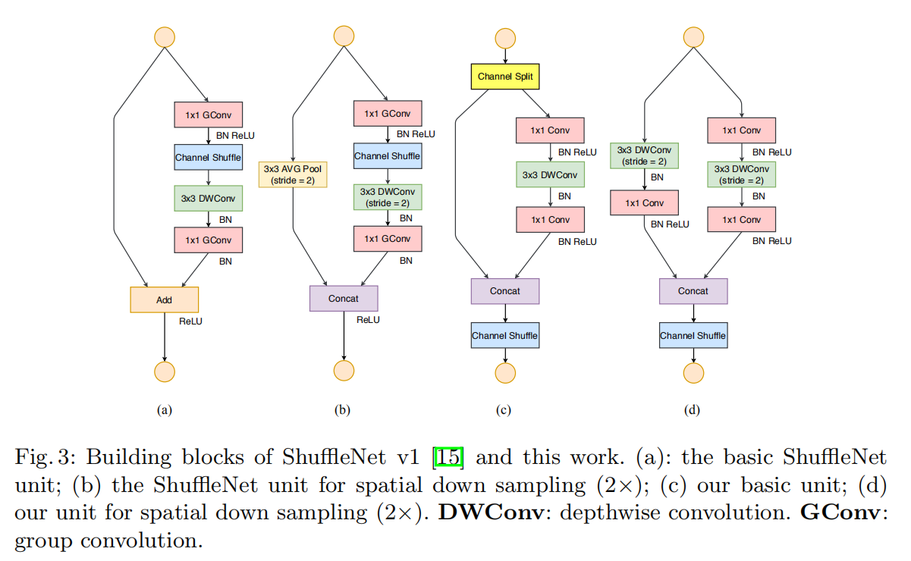

# Compact Network Design
## Content
### 2016
- [ ] [SqueezeNet](#squeezenet)

### 2017
- [ ] [Xception](#xception)
- [x] [MobileNet](#mobilenet)
- [ ] [ResNeXt](#resnext)
- [x] [ShuffleNet](#shufflenet)
- [ ] [CondenseNet](#condensenet)

### 2018
- [x] [MobileNetV2](#mobilenetv2)
- [x] [ShuffleNetV2](#shufflenetv2)
- [ ] [EfficientNet](#efficientnet)
---------------------
### SqueezeNet 

**"SqueezeNet: AlexNet-level accuracy with 50x fewer parameters and <0.5MB model size"**
	
----------------
### Xception 

**"Xception: Deep Learning with Depthwise Separable Convolutions"**

#### Questions

#### Reference
	
-------------------
### MobileNet 

**"MobileNets: Efficient Convolutional Neural Networks for Mobile Vision Applications"**
	
1. Depthwise separable convolution

(This figure is a little confusing that the last 1x1 conv actually is a ordinary 1x1 conv layer that has depth of M, and there are N such filters)

Standard convolution has the computatianal cost of:
$$
D_K \cdot D_K \cdot M \cdot N \cdot D_F \cdot D_F
$$

where $D_K$ is the size of the kernel, $D_F$is the size of the input feature map, $M$ and $N$ is the number of input and out put channels.

Depthwise saparable convolutions cost:

$$
D_K \cdot D_K \cdot M \cdot D_F \cdot D_F + M \cdot N \cdot D_F \cdot D_F
$$

2. Width Multiplier α is introduced to **control the input width of a layer**, for a given layer and width multiplier α, tαhe number of input channels M becomes αM and the number of output channels N bocomes αN

3. Resolution Multiplier ρ is introduced to **control the input image resolution**of the network

4. Overall architecture

#### Questions

- 请简要介绍MobileNet

  MobileNet是一种轻量级神经网络模型，它通过Depthwise separable convolution的方式大大降低了运算量。DW卷积的原理是对输入的每一通道分离，分别用一个filter进行卷积操作，得到一个feature map，之后所有的feature map再通过一个1x1PW卷积进行通道变换，解决DW卷积导致的通道之间信息交流不畅的问题。

- 与传统卷积的运算量对比

  假定输入为$D_k \times D_k \times M$的tensor，输出通道数为N，传统卷积的运算量为$D_K \cdot D_K \cdot M \cdot N \cdot D_F \cdot D_F$, DW卷积的运算量为$D_K \cdot D_K \cdot M  \cdot D_F \cdot D_F$, PW卷积的运算量为$M \cdot N \cdot D_F \cdot D_F$.

#### Reference

[1][**"MobileNets: Efficient Convolutional Neural Networks for Mobile Vision Applications"**](https://arxiv.org/abs/1704.04861)

[2][Keras implementation](https://github.com/keras-team/keras-applications/blob/master/keras_applications/mobilenet.py)

[3][Review: MobileNetV1 — Depthwise Separable Convolution (Light Weight Model)](https://towardsdatascience.com/review-mobilenetv1-depthwise-separable-convolution-light-weight-model-a382df364b69)

---------------------
### ResNeXt 

**"Aggregated Residual Transformations for Deep Neural Networks"**
	

---------------------
### ShuffleNet 

**"ShuffleNet: An Extremely Efficient Convolutional Neural Network for Mobile Devices"**
	
1. Channel shuffle

   Stacked group convolutions has one side effect: outputs from a certain channel are only derived from a small fraction of input channel, this property blocks information flow between channel groups and weakens representation.

   Then it is naturally to shuffle the channels between group convolutions, making  it possible to fully relate the input and output channels. Moreover, it is also differentiable, which means it can be embedded into network structure for end-to-end training.

2. Shuffle Unit

   

   (a) is a residual block with 3x3 depthwise convolution. Then replace the first 1x1 layer with pointwise group convolution followed by a channel shuffle operation. And the second pointwise group convolution is to recover the channel dimension to match the shortcut path.(Which is (b))

   And (c) is how shuffle net apply stride=2, it's a inception like structure.

   Given the input size of c x h x w and the bottleneck channels m, group number g, the number of FLOPs of shuffle net unit is:
   $$
   hwcm/g + 9hwm + hwcm/g = hw(2cm/g+9m)
   $$
   
3. Ablation study

   1. Model with group convolutions (g>1) consistently perform better than the counterparts without pointwise group convolutions(g=1), smaller models tend to benefit more from groups.
   2. When group number is relatively large, models with channel shuffle outperform the counterparts by a significant margin, which shows the importance of cross-group information interchange.

#### Questions

- 介绍一下shuffle net

  shuffle net是一种轻量级网络，它通过group convolution和depthwise convolution来减小网络的运算复杂度。shuffle net的创新点在于在group convolution之后增加了一个channel shuffle，可以解决group conv各group之间信息无法流通导致的模型表达能力下降的问题。

- 画一下shuffle net的结构，计算复杂度

  见前述

#### Reference

[1] [ShuffleNet: An Extremely Efficient Convolutional Neural Network for Mobile Devices](https://arxiv.org/abs/1707.01083)
	

---------------------
### CondenseNet 

**"CondenseNet: An Efficient DenseNet using Learned Group Convolutions"**

----------------------
### MobileNetV2 

**"MobileNetV2: Inverted Residuals and Linear Bottlenecks"**
	
1. Linear Bottlenecks

Deep networks only have the power of a linear classifier on the non-zero volume part of the output domain, on the other hand, when ReLU collapses the channel, it inevitably loses information in that channel.

	- if the manifold of interest remains non-zero volume after ReLU transformation, it corresponds to a linear transformation.
	- ReLU is capable of preserving complete information about the input manifold, but only if the input manifold lies in a low-dimensional subspace of the input space.

Assuming the manifold of interest is low-dimensional we can capture this by inserting linear bottleneck layers into the convolutional blocks. Experimental evidence suggests that **using linear layers is crucial as it prevents non-linearities from destroying too much information**.

2. Inverted residuals

$h \cdot w \cdot k \cdot t (k + d^2 + k')$

3. Convolutional Blocks

The first 1x1 Conv in MobileNetV2 is used for expanding input depth (by 6 default).

4. Overall Architecture

#### Questions

- V2相比V1有哪些改进

  1. 采用inverted residual结构，在block中第一个1x1conv和DW conv之间进行通道扩大以提取更多特征，并在stride=1的block最后采用与ResNet类似的相加结构。
  2. 为避免ReLU对特征的破坏，在residual block的相加之前的1x1conv采用线性激活

- 为什么使用线性激活

  文章认为网络的激活函数会产生一份信息的副本，且此副本存在某种低维子空间表示，因此可以对通道进行降维，但是当维度较低时非线性激活会产生较大的信息损失。因此文章先将通道数扩大，再进行激活，而最后通道缩小时则采用线性激活以避免信息损失。

#### Reference

[1][**"MobileNetV2: Inverted Residuals and Linear Bottlenecks"**](https://arxiv.org/abs/1801.04381)

[2][Keras implementation](https://github.com/keras-team/keras-applications/blob/master/keras_applications/mobilenet_v2.py)

[3][Review: MobileNetV2 — Light Weight Model (Image Classification)](https://towardsdatascience.com/review-mobilenetv2-light-weight-model-image-classification-8febb490e61c)

-------------------
### ShuffleNetV2 

**"ShuffleNet V2: Practical Guidelines for Efficient CNN Architecture Design"**
	
1. Metrics for efficient computation

   Widely used metric--**the number of float-point operations, or FLOPs**--is not equivalent to the direct metric we really care about, such as speed or latency.

   - first, several important factors that have considerable affection on speed are not taken into account by FLOPs.One such factor is **memory access cost (MAC)**, Another one is **degree of parallelism**.
   - Second, operations with the same FLOPs could have different running time, depending on the platform.

2. Practical Guidelines for Efficient Network Design

   1. **Equal channel width minimizes memory access cost (MAC)**

       We study the kernel shape of the 1 × 1 convolution. The shape is specified by two parameters: the number of input channels $c_1$ and output channels $c_2$. Let h and w be the spatial size of the feature map, **the FLOPs of the 1 × 1 convolution is $B = hwc_1c_2$. ****The memory access cost**
      **(MAC), or the number of memory access operations, is $MAC = hw(c_1+c_2)+c_1c_2$**. So
      $$
      MAC \ge 2\sqrt{hwB} + \frac{B}{hw}
      $$
      Therefore, MAC has a lower bound given by FLOPs. **It reaches the lower bound when the numbers of input and output channels are equal**.

   2. **Excessive group convolution increases MAC**
      $$
      \begin{align*}
      MAC =& hw(c_1+c_2) + \frac{c_1c_2}{g}\\
      =& hwc_1 + \frac{Bg}{c_1} + \frac{B}{hw}
      \end{align*}
      $$
      where g is the number of groups and $B=hwc_1c_2/g$ is the FLOPs.  It is easy to see that, given the fixed input shape c1 × h × w and the computational cost B, **MAC increases with the growth of g**.

      Therefore, we suggest that *the group number should be carefully chosen based on the target platform and task. It is unwise to use a large group number simply because this may enable using more channels, because the benefit of accuracy increase can easily be outweighed by the rapidly increasing computational cost*

   3. **Network fragmentation reduces degree of parallelism**

      Though such fragmented structure has been shown beneficial for accuracy, it could decrease efficiency because it is unfriendly for devices with strong parallel
      computing powers like GPU. It also introduces extra overheads such as kernel launching and synchronization.

   4. **Element-wise operations are non-negligible**

      element-wise operations occupy considerable amount of time, especially on GPU. Here, the element-wise operators
      include ReLU, AddTensor, AddBias, etc. They have small FLOPs but relatively heavy MAC. Specially, we also consider depthwise convolution as an element-wise operator as it also has a high MAC/FLOPs ratio.

3. ShuffleNetV2 

   

   

   Note that there is an additional 1x1 convolution layer added right before global averaged pooling to mix up features.

#### Questions

- Shuffle net v2 对efficient computation提出了什么问题

  过去使用的评价标准FLOPs，即浮点运算数，并不能完全代表网络的运算性能，它与更直观的指标如速度之间存在一定差异性。因此文章重新考虑了之前的经典网络，提出了高效计算的一般性的原则，并提出了新的网络架构。

- shuffle net v2提出了哪些原则

  - bottle neck的或1x1 pointwise conv 的输入和输出channel数应尽量接近，这样可以在FLOPs一定的情况下，使内存消耗MAC达到其下界。
  - group channel的分组数越大，内存消耗MAC越大。因此应该谨慎得选择分组数
  - 类似于Inception的结构，网络的碎片化越严重，并行支路越多，网络速度越慢。（当然串行的网络结构也很慢），因此应当适当选择网络单元的宽度和深度。
  - element wise操作也不可忽视，如ReLU, Add以及depthwise conv对网络速度的影响也很大，应尽量减少此类操作。

- 试分析FLOPs和MAC的关系

  给定输入feature map大小为 h x w， 输入输出channel数为 m， n，1x1 conv layer的浮点运算数为$B = hwmn$，输入feature数为$hwm$, 输出feature数为$hwn$，卷积核参数为$mn$， 因此MAC总数为$MAC=hw(m+n) + mn$. 由不等式关系有$MAC \ge 2\sqrt{hwB} + \frac{B}{hw}$. 当m=n时达到下界。

- 简述shufflenet v2和v1的区别

  - v2在单元中首先按channel将feature map分为两组，一组作为shortcut，而不是复制一份作为shortcut
  - v2取消了1x1conv的group conv，因为分组会减低速度
  - v2将末端的add改为了concat，因为add会影响速度
  - v2将shuffle 操作移动到了concat之后，因为两路是不同的channel，这样可以加强两路之间的交流。
  - 对于stride=2的unit，没有channel split，两边各自进行strid=2的DW conv，最后feature map减半，channel数double
  - 在最后的global pool之前加了一层1x1 conv 加强通道之间的交流

#### Reference

[1] [ShuffleNet V2: Practical Guidelines for Efficient CNN Architecture Design](https://arxiv.org/abs/1807.11164)

[2] [Pytorch implementation](https://github.com/pytorch/vision/blob/master/torchvision/models/shufflenetv2.py)

[**back to top**](#content)
	

----------------------
### EfficientNet

