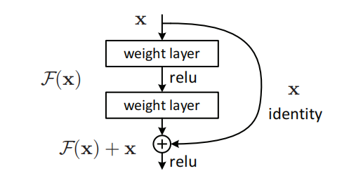
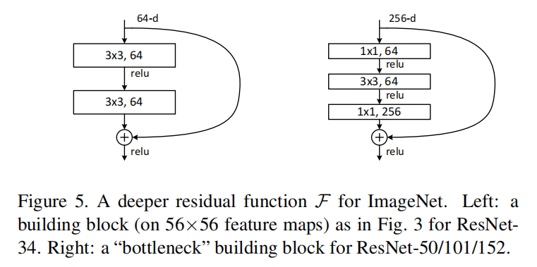

# Image Classification
## Content
### 2012
- [ ] [AlexNet](#alexnet)

### 2014
- [x] [VGG](#vggnet)
- [x] [NIN](#nin)

### 2015
- [x] [GoogleNet](#googlenet)
- [x] [ResNet](#resnet)
- [x] [Inception-v3](#inception-v3)

###  2016
- [x] [ResNet-v2](#resnet-v2)
- [x] [Inception-v4](#inception-v4)

### 2018
- [x] [DenseNet](#densenet)

-----------------
### AlexNet 

**"Imagenet classification with deep convolutional neural networks"**

#### Reference

[1] [**"Imagenet classification with deep convolutional neural networks"**](https://papers.nips.cc/paper/4824-imagenet-classification-with-deep-convolutional-neural-networks.pdf)

--------------------
### VGGNet

**"Very deep convolutional networks for large-scale image recognition"**
	

1. The use of stack 3×3 filters is effient than of 5×5 or 7×7 filters

2. A deep net with small filters outperforms a shallow net with larger filters

3. Combining the outputs of several models by averaging their soft-max class posteriors improves the performance due to complementarity of the models

#### Reference

[1] [**"Very deep convolutional networks for large-scale image recognition"**](https://arxiv.org/pdf/1409.1556.pdf)

[2] [Review: VGGNet — 1st Runner-Up (Image Classification), Winner (Localization) in ILSVRC 2014](https://medium.com/coinmonks/paper-review-of-vggnet-1st-runner-up-of-ilsvlc-2014-image-classification-d02355543a11)

[3] [Keras implement vgg-16](https://github.com/keras-team/keras-applications/blob/master/keras_applications/vgg16.py)

[4] [Keras implement vgg-19](https://github.com/keras-team/keras-applications/blob/master/keras_applications/vgg19.py)

----------------------
### NIN

**"Network In Network"**
	
1. Proposed a new network structure--mlpconv layer

  

2. Usually, fully connected layers are used at the end of network, however, they are prone to overfitting. This article used global average pooling layer as the last layer of the network, it is more native to the convolution structure by enforcing correspondences between feature maps and categories, and could prevent over-fitting.

#### Reference

[1] [**"Network In Network"**](https://arxiv.org/abs/1312.4400)

[2] [Review: NIN — Network In Network (Image Classification)](https://towardsdatascience.com/review-nin-network-in-network-image-classification-69e271e499ee)
	

	
------------------
### GoogLeNet

**"Going deeper with convolutions"**
	

1. **1×1 convolution** is used as a dimension reduction module to reduce the computation. By reducing the computation bottleneck, depth and width can be increased
2. When image’s coming in, **different sizes of convolutions** as well as max pooling are tried. Then different kinds of features are extracted.
3. **Global average pooling** is used nearly at the end of network by averaging each feature map from 7×7 to 1×1, and authors found that a move from FC layers to average pooling improved the top-1 accuracy by about 0.6%.
4. **Auxiliary classifiers** for combating gradient vanishing problem, also providing regularization.
5. besides the network design, the other stuffs like **ensemble methods**, multi-scale and multi-crop approaches are also essential to reduce the error rate

#### Questions

- inception 结构的优点

  文章认为，通过1x1, 3x3, 5x5并列最后拼接的结构，可以让模型同时感受到多尺度的特征。

- 1x1卷积的作用

  作用是对feature的通道数进行降维，可以大幅度减少模型的运算量，实际上这种分解方式可以通过low-rank来解释，用两个卷积层来等效一个卷积，但大大降低了运算量

- 预测为什么使用global average pooling

  相比全连接层，先通过global average pooling再连接Dense层或直接激活可以大大降低运算量，因为一个模型的最后一层FC往往参数量十分巨大，而且论文证明使用global average pooling的效果也略微更好一点

- 辅助分类器的作用

  对抗梯度消失问题，同时有一定的正则化作用

#### Reference

[1] [**"Going deeper with convolutions"**](https://www.cs.unc.edu/~wliu/papers/GoogLeNet.pdf)

[2] [Pytorch implement](https://github.com/pytorch/vision/blob/master/torchvision/models/inception.py)

[3] [Review: GoogLeNet (Inception v1)— Winner of ILSVRC 2014 (Image Classification)](https://medium.com/coinmonks/paper-review-of-googlenet-inception-v1-winner-of-ilsvlc-2014-image-classification-c2b3565a64e7)

---------------------
### ResNet

**"Deep residual learning for image recognition"**

1. Degradation problem

   With the network depth increasing, accuracy gets saturated and degrades rapidly, this may be caused by vanishing/exploding gradients problem. But in theory, a deeper network should produce no higher training error than its shallower counterpart.

2. Residual Block

   To solve the degradation problem, residual learning was proposed. Instead of hoping each layer directly fit a desired underlying mapping, we explicitly hope it fit a residual mapping. Denoting the underlying mapping as H(x), we fit a mapping F(x) = H(x) - x.

   Let's consider an extreme condition, if the identity mapping were optimal, it would be easier to push the residual to zero than to fit an identity mapping.

   

   The dimension of x and F(x) must be equal, if not, we could perform a linear projection to match the dimensions.

3. Bottleneck Architecture

   

   The 1x1 conv layer are used to reduce and then increase dimensions, leaving the 3x3 conv a bottleneck with smaller input/output dimensions.

#### Questions

1. ResNet的创新点？

   ResNet提出了残差学习的概念，以往的网络学习的是输入输出的潜在映射，假设为H(x)，而ResNet学习的是潜在映射与输入的残差，即F(x)=H(x)-x。作者认为学习残差比直接学习映射要更容易。假设当前输入已经最优，那么理论上没有残差，此时神经网络学习令残差为0显然是更容易的。

2. ResNet如何解决深层网络训练困难的问题

   神经网络越来越深以后，面对严重的梯度消失和梯度爆炸的问题，正确率常常呈现饱和然后快速下降的趋势，然而理论上更深的网络性能不应低于其较浅的版本。通过残差学习的方法，令神经网络的每一层更容易学习到我们想要的潜在映射，训练速度也更快，解决了深层网络训练困难的问题。

3. ResNet为什么能提升性能？

   学习残差相比直接学习潜在映射要更容易，因此也更容易达到最优。

4. 讲讲ResNet提出的bottleneck结构

   bottleneck是卷积核大小分别为1x1,3x3,1x1的三层网络的叠加，其中1x1 conv用于通道变换，分别将输入通道减少为原来的1/k，以及在3x3卷积之后将通道数恢复。这样可以大大减小3x3卷积的参数量及运算量。

5. ResNet的shortcut可以之间可以只有一层卷积层吗？

   不可以，因为这样残差块的表达式变为H(x) = F(x) + x = relu(Wx)+x, 接近于一个线性单元，实际测试效果也并不好。

#### Reference

[1] [Deep Residual Learning for Image Recognition](https://arxiv.org/abs/1512.03385)

[2] [Keras Implementation](https://github.com/keras-team/keras-applications/blob/master/keras_applications/resnet_common.py)

[3] [PyTorch Implementation](https://github.com/pytorch/vision/blob/master/torchvision/models/resnet.py)

------------
### Inception-v3

**"Rethinking the Inception Architecture for Computer Vision"**
	
1. Factorizing Convolutions with Large Filter Size

   In theory, we can **replace any n x n convolution by a 1 x n convolution followed by a n x 1 convolution** and the computational cost saving increases dramatically as n grows.

   In practice, **it is found that employing this factorization does not work well on early layers, but it gives very good results on medium grid-size.**

2. Utility of Auxiliary Classifiers

   The auxiliary classifiers act as **relularizer**.

3. Efficient Grid Size Reduction

   ** Conventionally**, such as AlexNet and VGGNet, the feature map downsizing is done by max pooling. But the drawback is either **too greedy by max pooling followed by conv layer**, or **too expensive by conv layer followed by max pooling**. Here, an efficient grid size reduction is proposed as follows:

With the efficient grid size reduction, **320 feature maps** are done by **conv with stride 2**. **320 feature maps** are obtained by **max pooling**. And these 2 sets of feature maps are **concatenated as 640 feature maps** and go to the next level of inception module.

**Less expensive and still efficient network** is achieved by this efficient grid size reduction.

4. Overall Architecture

5. General Design Principles
   1. **Avoid representational bottlenecks, especially early in the network.** One should avoid bottlenecks with extreme compression. In general, the representation size should gently decrease. Theoretically, information content can not be assessed merely by the dimensionality of the representation as it discards important factors like correlation structure, the dimensional merely provides a rough estimate of information content.
   2. **Higher dimensional representations are easier to process locally within a network.** Increasing the activation per tile in a network allows for more disentangled features. The resulting networks will train faster.
   3. **Spatial aggregation can be done over lower dimensional embeddings without much or any loss in representational power.** The strong correlation between adjacent units results in much less loss of information during dimension reduction.
   4. **Balance the width and depth of the network.** Increasing both the width and depth of the network can contribute to higher quality network.

#### Questions

- 相比googleNet有哪些改进

  - 用两个相连的3x3卷积代替5x5卷积，降低了运算复杂度。
  - 通过low-rank分解，将nxn的卷积分解为两个1xn和nx1的卷积，降低了模型的运算复杂度。
  - 通过stride=2的卷积和avg_pool的filter concat实现feature降维，是一种折中的解决方案。
  - 证明了辅助分类器的正则化作用

- 有什么缺点

  过于宽且深度不同的Inception block会大大降低模型的训练以及预测速度

#### Reference 

[1] [Rethinking the Inception Architecture for Computer Vision](https://www.cv-foundation.org/openaccess/content_cvpr_2016/papers/Szegedy_Rethinking_the_Inception_CVPR_2016_paper.pdf)

[2] [Keras implement](https://github.com/keras-team/keras-applications/blob/master/keras_applications/inception_v3.py)

[3] [Pytorch implement](https://github.com/pytorch/vision/blob/master/torchvision/models/inception.py)

[4] [Review: Inception-v3 — 1st Runner Up (Image Classification) in ILSVRC 2015](https://medium.com/@sh.tsang/review-inception-v3-1st-runner-up-image-classification-in-ilsvrc-2015-17915421f77c)
	
---------------
### ResNet-v2

**"Identity Mappings in Deep Residual Networks"**

1. Analysis of Deep Residual Networks

   Original residual unit:
   $$
   y_l = h(x_l) + F(x_l, W_l)\\
   x_{l+1} = f(y_l)
   $$
   If h and f are identity mapping:
   $$
   x_{l+1} = x_l + F(x_l, W_l)\\
   x_L = x_l + \sum_{i=l}^{L-1}F(x_i, W_i)
   $$
   Which means the feature $x_L$ of any deeper unit L can be represented as the feature $x_l$ of any shallower unit l plus a residual function F, the feature $x_L$ of any deep unit L, is the summation of the outputs of all preceding residual functions (plus $x_0$). **This ensures that information is directly propagated back to any shallower unit.**

2. Importance of Identity Skip Connections

   Shortcut connections are the most direct paths for the information to propagate. Multiplicative manipulations (scaling, gating, 1x1 convolutions, dropout) on the shortcuts can hamper information propagation and lead to optimization problem

3. Pre-Activation

   1. the optimization is further eased because f is an identity mapping
   2. using BN as pre-activation improves regularization of the model

#### Questions

1. ResNetV2 主要讲了什么？

   作者重新思考了resnet的residual unit，提出了一种新的residual unit，shortcut改为完全的identity connection，去除之前的ReLU层，同时将每一层之后的激活和BN放到之前

2. 为什么Identity Skip Connection效果好

   根据文章的介绍，直接的identity连接可以让每一层直接连接到前面所有层的输出上，让梯度反向传播更加通畅，identity的连接也不容易发生梯度消失或爆炸的问题。

3. 为什么采用pre-activation

   将BN和激活函数放在卷积之前，可以保证卷积输入的分布一定是稳定的，防止未经BN激活的shorcut流入卷积层，同时还保证了shortcut的identity

#### Reference

[1] [Identity Mappings in Deep Residual Networks](https://arxiv.org/abs/1603.05027)

[2] [Keras Implementation](https://github.com/keras-team/keras-applications/blob/master/keras_applications/resnet_common.py)

----------------------
### Inception-v4

**"Inception-v4, Inception-ResNet and the Impact of Residual Connections on Learning"**
	
1. It is studied that whether the Inception itself can be made more efficient by making it deeper and wider.

   In order to optimize the training speed, **the layer sizes was tuned carefully to balance the computation between the various model sub-networks**.

2. Since the residual connections are of inherent importance for  training very deep architectures. **it is natural to replace the filter concatenation stage of the Inception architecture with residual connections.**

   **Inception-Resnet-v1 was training much faster, but reached slightly worse final accuracy than Inception-v3.** 

   If the number of filters exceeded 1000, the residual variants started to exhibit instabilities, and the network just “died” early during training. This could be prevented, neither by lowering the learning rate, nor by adding an extra BN to this layer. However, scaling down the residuals before adding them to the previous layer activation seemed to stabilize the training.

   Two-phase training is also suggested, where the first "warm-up" phase is done with very low learning rate, followed by a second phase with high learning rate.

#### Questions

- 有什么改进
  - 微调inception结构来弥补其在运算速度上的劣势
  - 改用residual结构来提高模型训练的速度

#### Reference

[1] [[Inception-v4, Inception-ResNet and the Impact of Residual Connections on Learning](https://www.aaai.org/ocs/index.php/AAAI/AAAI17/paper/download/14806/14311)

[2] [Keras Implementation](https://github.com/keras-team/keras-applications/blob/master/keras_applications/inception_resnet_v2.py)

-------------------
### DenseNet 

**"Densely Connected Convolutional Networks"**

1. DenseBlock

   Standard ConvNet

   

   ResNet

   

   DenseNet

   

   Each layer obtains additional inputs from all preceding layers and passes on its own feature maps to all subsequent layers. 

   Feature maps output by current layer and preceding layers are combined together by concatenating them.

   

   DenseNet layers are very narrow (e.g., 12 filters per layer), adding only a small set of feature maps to the collective knowledge of remaining feature maps unchanged and the final classifier makes a decision based on all feature map in the network.

   Besides better parameter efficiency, one big advantage of DenseNets is their **improved flow of information and gradients** througout the network, which makes them easy to train. Each layer has direct access to the gradients from the loss function and the original input signal, leading to an implicit deep supervision.

2. Overall architecture

   

3. Model Compactness

   As a direct consequence of the input concatenation, the feature-maps learned by any of the DenseNet layers can be accessed by all subsequent layers. This encourages feature reuse throughout the network, and leads to more compact models.

4. Implicit Deep Supervision

   One explanation for the improved accuracy of dense convolutional networks may be that individual layers receive additional supervision from the loss function through the shorter connections.

   A single classifier on top of the network provides direct supervision to all layers through at most two or three transition layers. However, the loss function and gradient of DenseNets are substantially less complicated, as the same loss function is shared between all layers.

5. Feature Reuse

   By design, DenseNets allow layers access to feature-maps from all of its preceding layers (although sometimes through transition layers). We conduct an experiment to investigate if a trained network takes advantage of this opportunity.

   1. All layers spread their weights over many inputs within the same block. This indicates that features extracted by very early layers are, indeed, directly used by deep layers throughout the same dense block.
   2. The weights of the transition layers also spread their weight across all layers within the preceding dense block, indicating information flow from the first to the last layers of the DenseNet through few indirections.
   3. The layers within the second and third dense block consistently assign the least weight to the outputs of the transition layer (the top row of the triangles), indicating that the transition layer outputs many redundant features (with low weight on average). This is in keeping with the strong results of DenseNet-BC where exactly these outputs are compressed
   4. Although the final classification layer, shown on the very right, also uses weights across the entire dense block, there seems to be a concentration towards final feature-maps, suggesting that there may be some more high-level features produced late in the network.

#### Questions

1. 讲讲DenseNet

   DenseNet的主要思想是用shortcut connection将所有网络层都连接起来，形成密集的层之间的全连接，这样可以让每一层都能得到之前所有层的信息作为输入，同时，每一层都能与最后的分类器连接，这样可以让信息和梯度的流通更加顺畅。

2. DenseNet和ResNet的异同

   DenseNet和ResNetV2很像，区别是DenseNet的shortcut是用filter concatenation，而ResNet的shortcut是feature addition.不仅数据连通流动的方式不同，网络结构上也因此产生了很大的区别。DenseNet每一层的filter数很少，产生的新的feature map 直接拼接到输入数据中，对之前层产生信息的重复利用，让DenseNet的filter数可以很少，参数量少于ResNet

#### Reference

[1] [Densely Connected Convolutional Networks](https://arxiv.org/abs/1608.06993)

[2] [Review: DenseNet — **Dense Convolutional Network** (Image Classification)](https://towardsdatascience.com/review-densenet-image-classification-b6631a8ef803)

[2] [Keras Implementation](https://github.com/pytorch/vision/blob/master/torchvision/models/densenet.py)
